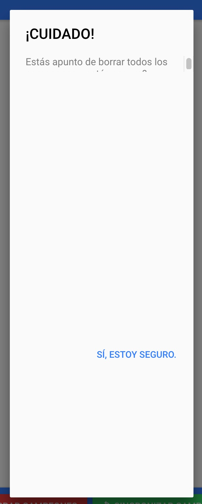

# Cómo arreglar el problema del alert feo

Os puede haber pasado que al añadir un alert de Ionic, este se ve bien dentro de la previsualización de la aplicación en StackBlitz. Sin embargo, al desplegar la aplicación en Firebase, se ve demasiado grande (se ve en el siguiente pantallazo).

Pues bien, eso se puede arreglar si añadimos el siguiente código CSS en el fichero `app/app.scss`:

```css
.button-inner {
  height: 5%; 
}
```

Si volvéis a despegar la aplicación en Firebase debería haberse corregido este problema y volveréis a ver de forma correcta los alerts.




