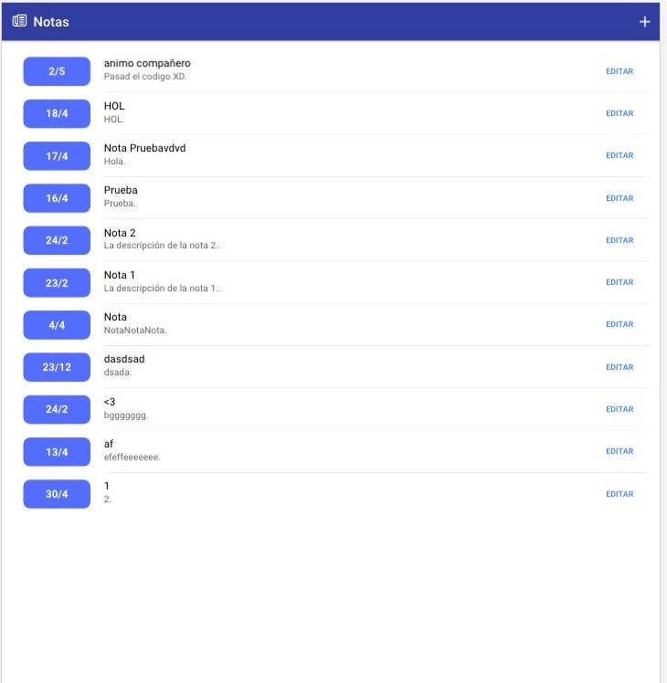
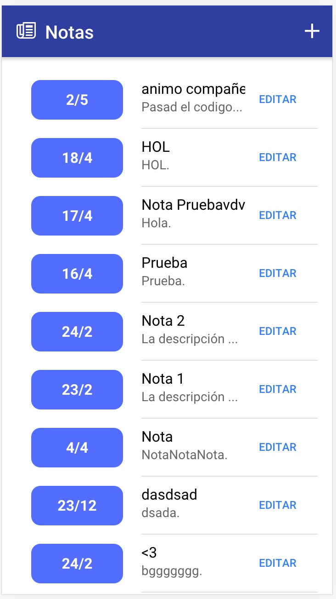

# Hacer app responsive

Ionic está preparado para que nuestras aplicaciones puedan adaptarse a cualquier dispositivo con el que la estemos visualizando. Esta característica de las aplicaciones se llama ser **responsive**. Cuando una aplicación es responsive, estamos queriendo decir que se verá bien en cualquier dispositivo, bien sea un ordenador, una tablet o un móvil. El diseño y tamaño de los elementos se adaptarán al tamaño de la pantalla de ese dispositivo.

Cuando desplegáis vuestras aplicaciones en Firebase, es posible que tratéis de acceder a ellas con el móvil y no sea vea realmente bien. Lo que probablemente os ocurrirá es que se verá más bien como una web que tiene muy poco zoom. Algo parecido a esto:



Como podréis comprobar, esto no está demasiado adaptado para el uso con dispositivos móviles, aunque se vea bien desde el ordenador.

**Si queréis que vuestra aplicación sea responsive**, tenéis que modificar el fichero `index.html` que se encuentra en la raíz del proyecto y sustituir el contenido por el código que hay en el siguiente enlace: [https://gist.githubusercontent.com/Dellos7/656075c49ad516ad01df5d14d3c8bc1f/raw/febe27526acc5e28517c0d3d3dd36f057b404d45/index.html](https://gist.githubusercontent.com/Dellos7/656075c49ad516ad01df5d14d3c8bc1f/raw/febe27526acc5e28517c0d3d3dd36f057b404d45/index.html).

Si desplegáis de nuevo la aplicación a Firebase y accedéis desde el móvil, debería verse correctamente, con un diseño y tamaño adaptado al dispositivo.

Si alguien tiene interés en saber por qué funciona o qué está ocurriendo, realmente la etiqueta del `html` que está haciendo esto posible es la siguiente:

```html
<meta name="viewport" content="width=device-width, initial-scale=1.0, minimum-scale=1.0, maximum-scale=1.0, user-scalable=no">
```

En [este artículo](https://webdesign.tutsplus.com/es/articles/quick-tip-dont-forget-the-viewport-meta-tag--webdesign-5972) explica mejor por qué y qué es lo que hace exactamente esta etiqueta.

Si todo va bien, deberíais ver vuestra aplicación adaptada al dispositivo, como esta:

