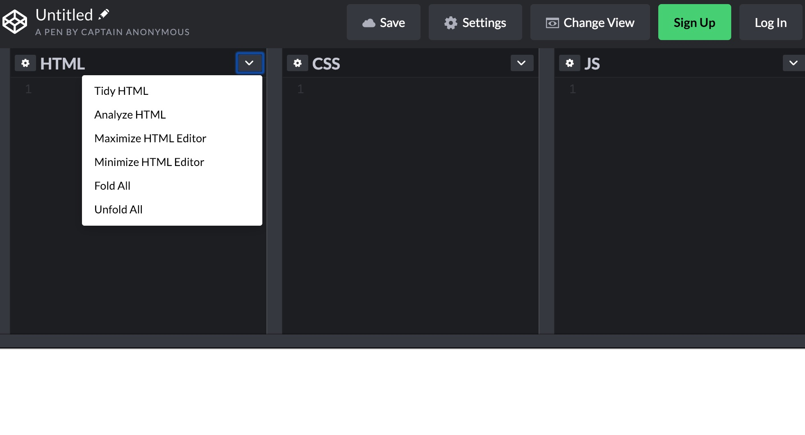
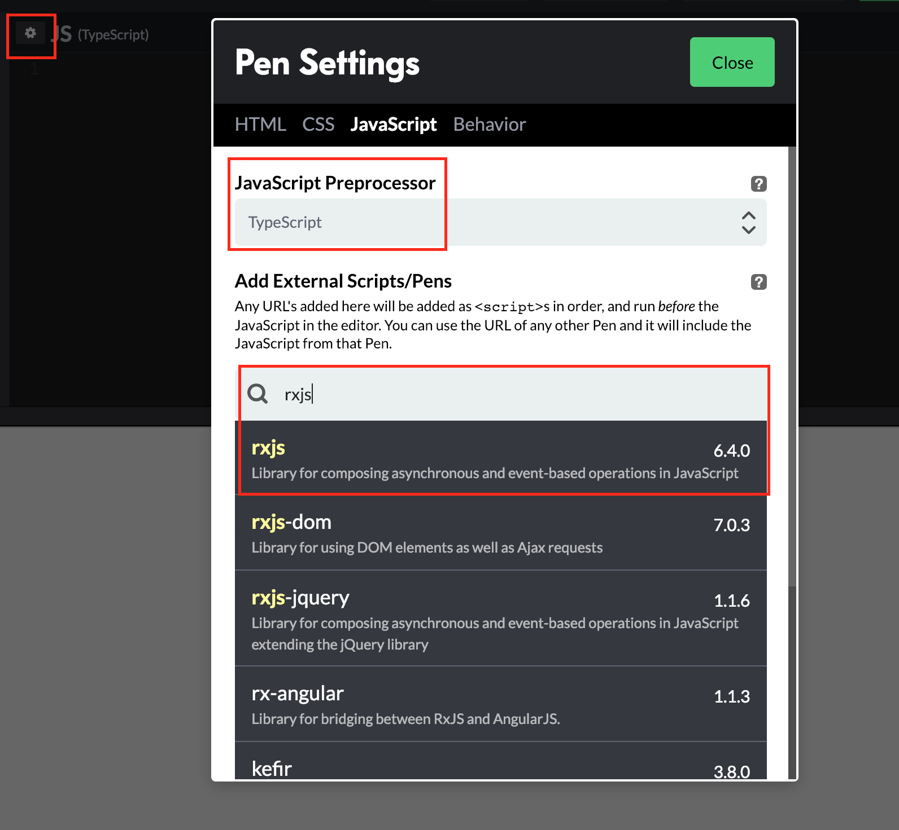

# Observables

## Antes de empezar

Para probar el código, ve a [https://codepen.io/pen/](https://codepen.io/pen/). Es una página donde podemos probar código HTML, CSS (SCSS) y JavaScript (TypeScript) online.

Minimiza tanto el HTML como el CSS, desde las flechitas y con la opción `Minimize HTML Editor` y `Minimize CSS Editor`.



Ahora, añade a la configuración de JavaScript `TypeScript` como `JavaScript Preprocessor`, y en `Add External Scripts/Pens`, busca `rxjs` y añade la primera que aparezca.



Lo que estamos haciendo es:
1. Indicar que utilizaremos `TypeScript` como preprocesador de JavaScript (compilará el código TypeScript a JavaScript).
2. Añadir la librería `rxjs` de JavaScript para poder utilizar los Observables.

Ahora, abre la consola del navegador (típicamente `F12`). Es en esta consola donde podremos imprimir utilizando JavaScript para hacer pruebas, al estilo de la consola típica de Java.

## Probando los observables

**Podemos pensar en un observable como si fuera una función**. De hecho, tanto el observable como la función tiene la misma finalidad: devolver valores. 

**La diferencia** entre un observable y una función es que la función devuelve uno (o varios) valores de golpe. Pero sólo una vez cada vez que se le invoca. Al observable se le invoca una vez (realmente, te *suscribes* al observable), y puede devolver múltiples valores a lo largo del tiempo.

Veamos un ejemplo. Así es como se utilizan las funciones:

```typescript
let foo = function() {
  console.log('Hola');
  return 42;
  return 100; // código muerto. Nunca se llegará a ejecutar
};

console.log('antes');
console.log(foo());
console.log('después');
```

Resultado en la consola:

```
antes
Hola
42
después
```

Y así los observables:

```typescript
let foo = rxjs.Observable.create( (observer) => {
  console.log('Hola');
  observer.next(42);
  observer.next(100); // devolver otro valor
  observer.next(200); // devolver otro valor
});

console.log('antes');
foo.subscribe( (num) => {
  console.log(num);
});
console.log('después');
```

Resultado en la consola:

```
antes
Hola
42
100
200
después
```

Como podemos ver, con la función `next` del objeto recibido por parámetro en la función `create` podemos devolver múltiples valores con solo invocar una vez al observable.

La función `subscribe` del observable simula que nos estamos suscribiendo a ese observable. Todo aquel que se suscribe al observable se llama observer. De esta forma, en la función *callback* que pasamos por parámetro al método `subscribe` es donde podemos recibir los distintos valores devueltos por el observable.

Lo más interesante de los observables es, sin duda, que **permiten obtener valores de forma asíncrona**. Es decir, nos podemos suscribir al observable, recibir un valor, y al cabo de un tiempo (unos segundos, minutos, etc.) podemos volver a recibir otro valor.

Un ejemplo sería el siguiente:

```typescript
let foo = rxjs.Observable.create( (observer) => {
  console.log('Hola');
  observer.next(42);
  observer.next(100); // devolver otro valor
  observer.next(200); // devolver otro valor
  setTimeout(() => {
    observer.next(300); // devuelve otro valor al cabo de 1000ms (1s)
  }, 1000);
});

console.log('antes');
foo.subscribe( (num) => {
  console.log(num);
});
console.log('después');
```

El resultado sería el siguiente:

```
antes
Hola
42
100
200
después
300
```

Si nos fijamos, se imprimirá el valor `300` después del valor `después`, ya que se ejecuta de forma asíncrona utilizando la función `setTimeout`.

Si quisiéramos en algún momento que el observable dejara de devolvernos valores, podríamos hacerlo así:

`foo.unsubscribe();`

Por tanto, **los observables son útiles** ya que permiten que podamos recibir más de un valor (al contrario que con las funciones). **Esto es útil, por ejemplo, si nos suscribimos a un observable conectado a una base de datos**, de tal forma que podríamos recibir actualizaciones en tiempo real de la base de datos en ese observable, sin necesidad de tener que actualizar ni volver a llamar nosotros a la función correspondiente para obtener datos. **Sería la función que le pasamos al método `subscribe` (a modo de callback) la que se ejecutaría** cuando la base de datos nos hubiera enviado ya los datos que le hubiéramos pedido.