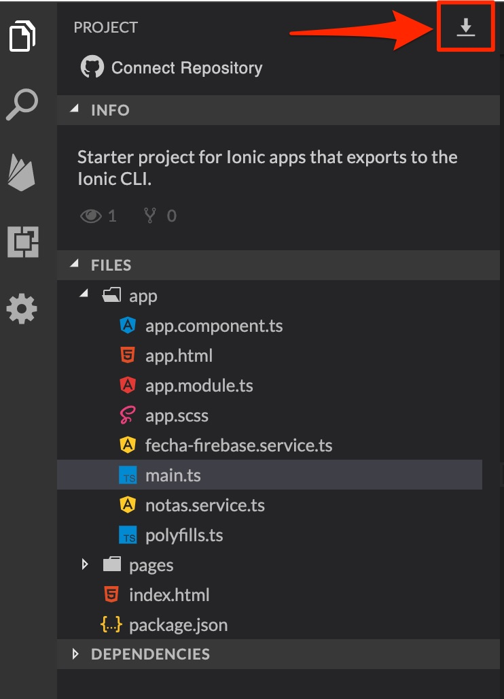

# Práctica 1: Introducción al desarrollo de aplicaciones web con Angular e Ionic

En esta práctica aprenderás los conceptos fundamentales de **Angular** e **Ionic**, dos *frameworks* (un *framework* es, en resumidas cuentas, un kit de herramientas) muy potentes, que dotan de muchas funcionalidades al clásico conjunto *HTML, CSS y JavaScript*, y que sirven para desarrollar aplicaciones web muy dinámicas y visuales.

Con estos dos frameworks, aprenderemos a desarrollar aplicaciones web como esta (la cual desarrollaremos en las siguientes prácticas): [https://app-lol-3340f.firebaseapp.com/?40864](https://app-lol-3340f.firebaseapp.com/?40864). Y, además, **integradas con una base de datos no relacional: Firebase**.

Para ello, utilizarás una plataforma online llamada **[StackBlitz](https://stackblitz.com/)**, que es, al final, un IDE (*Entorno de Desarrollo Integrado*) optimizado para desarrollar aplicaciones web utilizando estos frameworks. En la práctica aprenderás cómo utilizarlo.

## Entrega

Tendrás que entregar:
* Enlace al **proyecto de StackBlitz para poder ver el código de la aplicación**. Simplemente, el enlace al código de tu proyecto de StackBlitz.
* **Código fuente** en un .zip de la aplicación de StackBlitz.
* **Un documento** con las siguientes reflexiones:
    - ¿Qué has aprendido en esta práctica?
    - ¿Qué te ha parecido más interesante?
    - ¿Qué no te ha quedado claro o crees no esta bien explicado?

Todo ello en el [aula virtual](https://aules.edu.gva.es/moodle/mod/assign/view.php?id=24852).

👉🏻 [¡Comencemos!](./practica-angular-ionic-1.md)

> **NOTA**: Para descargar el proyecto de Stackblitz:

