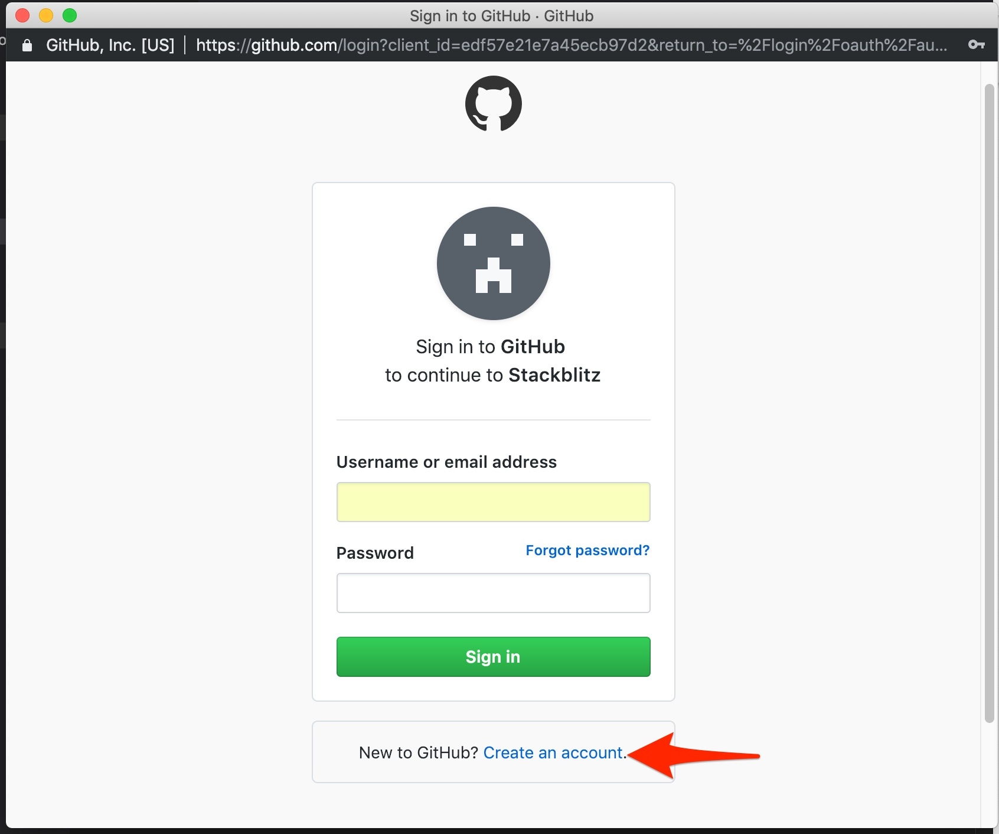
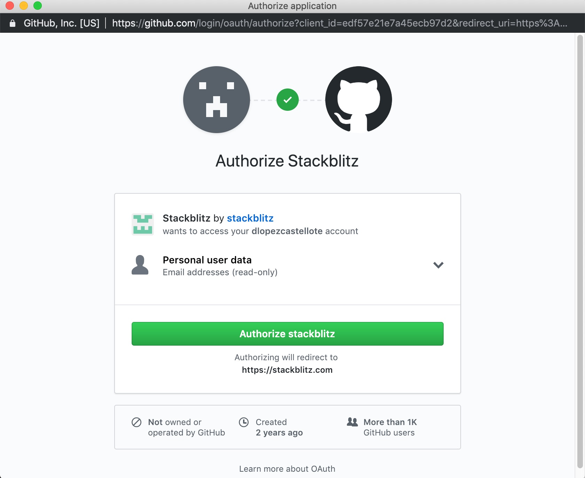
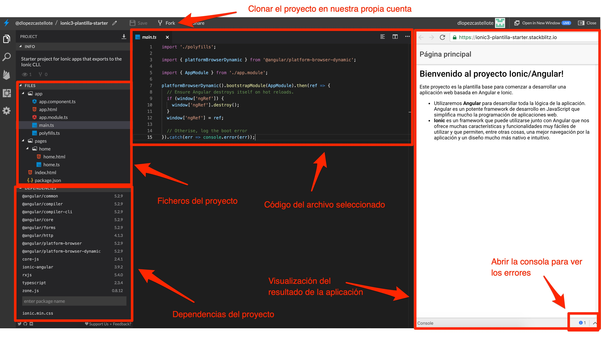

# StackBlitz

[**StackBlitz**](https://stackblitz.com/) es una plataforma online que emula el famoso IDE de escritorio Visual Studio Code. Permite desarrollar aplicaciones web de muchos tipos de forma totalmente online y gratuita, sin tener que instalar por tanto nada en nuestro ordenador. Además, cuenta con una integración directa con Firebase Hosting, de tal forma que podemos desplegar nuestra aplicación web en la nube de forma muy sencilla y... ¡gratis!

## Crear una cuenta en StackBlitz

Accede al siguiente enlace: [https://stackblitz.com/edit/ionic3-plantilla-starter](https://stackblitz.com/edit/ionic3-plantilla-starter). StackBlitz no tiene una base de datos propia de usuarios, si no que permite hacer login utilizando GitHub. Fíjate en la barra superior de navegación, y haz click en *Sign in*. En la siguiente pantalla, crea una cuenta con GitHub, si es que no tienes una ya. 

Necesitarás una cuenta de correo electrónico para poder crear la cuenta. Elige en el paso 2 la opción *Free*. Al final del proceso, te pedirá que des permisos a StackBlitz en tu cuenta de GitHub:

En este momento, ya debería aparecerte en la barra superior de navegación de StackBlitz tu usuario asociado a GitHub.

## Proyecto en StackBlitz

Fíjate en la siguiente captura de pantalla, donde se muestran los distintos elementos de los que se compone un proyecto de StackBlitz. 

Utilizar StackBlitz es muy fácil: **crear, eliminar o actualizar los ficheros actualizará la visualización de la aplicación que tenemos a la derecha**.

Si cometemos un **error** en el código, normalmente nos aparecerá en la propia vista de previsualización de la aplicación, pero en ocasiones tenemos que fijarnos en los errores de la consola para obtener más información.

> **Nota**: Por defecto, StackBlitz actualiza la visualización de la aplicación a medida que vamos escribiendo. Si queremos cambiar esta opción para que solo actualice la aplicación al guardar los ficheros (recomendable), podemos hacerlo en las opciones de configuración, que aparece en la barra izquierda del proyecto (rueda de engranaje). Cambiaríamos la opción *Hot reload trigger* a **Save**.

## Clonar el proyecto en nuestra cuenta de StackBlitz

Podemos editar proyectos ajenos (como el del enlace al que has accedido), pero no podremos guardarlos. Esto es útil para hacer pruebas, pero si no podemos guardar los cambios del proyecto, al recargar el proyecto habremos perdido los cambios. 

Por ello, debemos **clonar el proyecto en nuestra cuenta de StackBlitz**. Si te fijas en la captura de pantalla anterior, es tan sencillo como hacer click sobre el botón **Fork** de la barra superior de navegación. Hazlo: **clona el proyecto en tu cuenta de StackBlitz**.

> **Nota**: necesitarás estar logueado en StackBlitz para poder clonar el proyecto.

---

Ves al siguiente paso: [Estructura de un proyecto Angular](practica-angular-ionic-2.md).