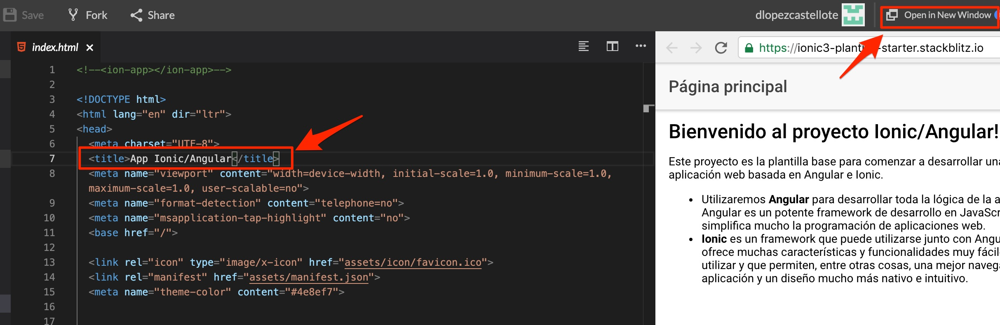
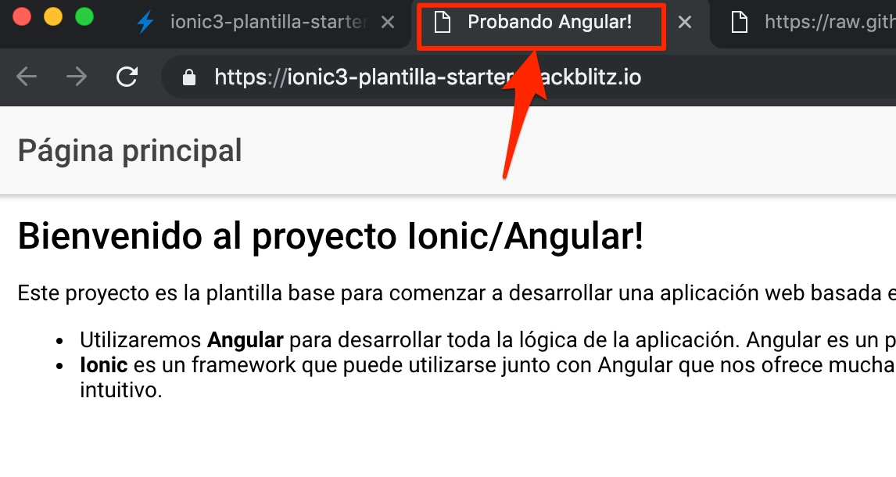
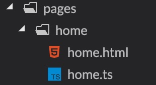
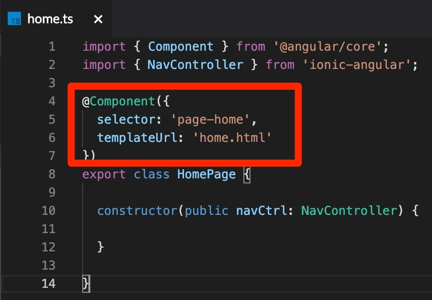
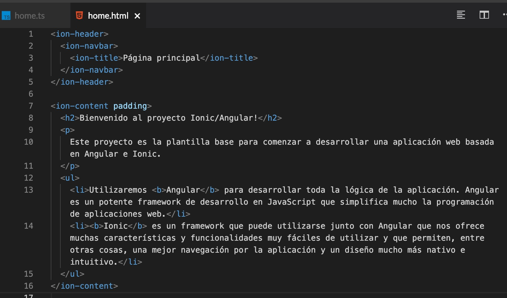
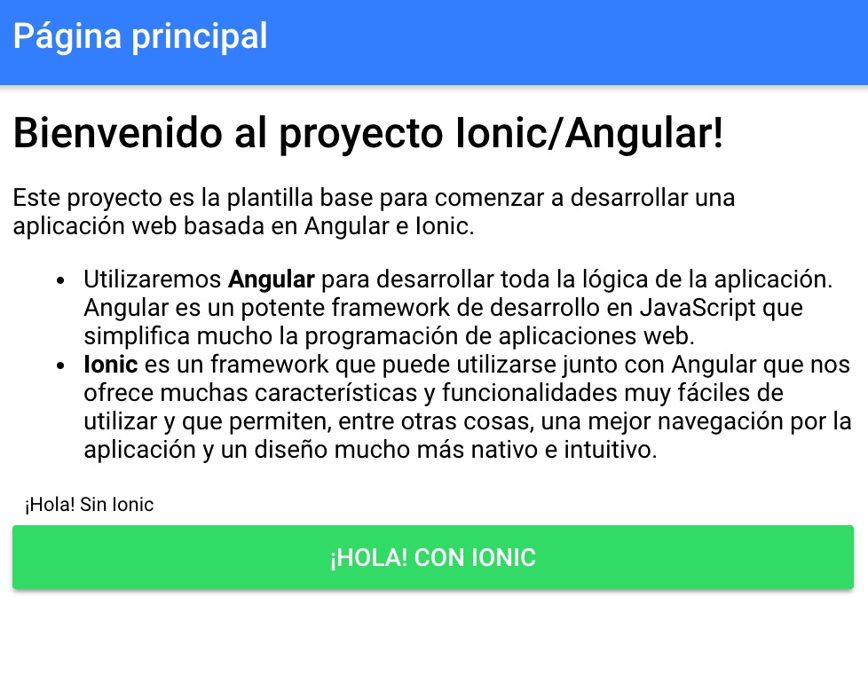

# Estructura de un proyecto Angular

## ¿Qué es Angular?

[Angular](https://angular.io/) es un framework de desarrollo de aplicaciones web que utiliza el lenguaje de pgoramación JavaScript. 

Permite desarrollar una aplicación dividiéndola en **páginas**. Las páginas son pues, eso, una página normal de una web. La diferencia es que cada una de estas páginas está controlada por un código TypeScript llamado controlador, que es, en resumen, una clase en lenguaje TypeScript.

Por ahora no es necesario que entremos más en detalle sobre qué es Angular, ya lo irás descubriendo por el camino 😏

## Ficheros y directorios

Verás que en el proyecto tiene creados por defecto muchos ficheros. No tienes que entender ni saber para qué sirve cada uno de estos ficheros, por ahora sólo vamos a ver los más básicos.

### Fichero `index.html`

Como probablemente ya sabrás (y, si no, te lo digo yo), el fichero `index.html` suele ser el fichero principal de prácticamente cualquier página web. Este fichero es el fichero raíz de la  web, y en él podemos escribir código HTML, CSS, JavaScript... 

Para que veas que, al final, estamos desarrollando una página web *normal y corriente*, puedes acceder al fichero `index.html`, que se encuentra en la raíz del proyecto, para ver qué contiene.

En un proyecto Angular, normalmente no tendrás que modificar este fichero para nada, ya que ya contiene el código necesario para que funcione como es debido.

Pero, si quieres, puedes probar a modificar el texto que se encuentra entre las etiquetas `<title>` y `</title>`, y pon algo así como: `Probando Angular!`. 




Después, abre la aplicación utilizando el botón `Open in New Window`. Esto lo que hace es abrir la visualización de la aplicación en una pestaña nueva del navegador.

Deberías ver, sobre la pestaña del navegador, el título que acabas de poner:




### Fichero `app/app.component.ts`

Este es el siguiente fichero por el que te tienes que empezar a preocupar, pero tampoco demasiado.

En este fichero es donde comenzaremos a desarrollar nuestra aplicación. Aquí es donde indicamos **cuál será la página principal de la aplicación**, entre otras cosas.

Por ahora seguimos adelante, que luego volveremos a este fichero.

### Directorio `pages`

**Todas las páginas de la aplicación las definiremos en el directorio `pages`**. Y, dentro del directorio `pages`, crearemos un directorio para cada página que creemos. 



Como vemos, el directorio `pages/home` tiene dos ficheros: `home.html` y `home.ts`. También podría contener un fichero `home.css` o `home.scss`, donde podríamos añadir los estilos CSS o SCSS necesarios para nuestra página.

Fíjate en el contenido del fichero `pages/home/home.ts`. 



Este fichero es, simplemente, una clase: la clase `HomePage`. Sin embargo, con la anotación `@Component` que ofrece Angular, le estamos indicando lo siguiente:
* **`selector`**. Estamos diciendo que su selector en el código HTML será `page-home`. Esto permite que si queremos después utilizar esta página en otro fichero HTML, tendremos que indicarlo simplemente así: `<page-home></page-home>`. Igual que hicimos en el `index.html` con `<ion-app></ion-app>`, ¿recuerdas?
* **`templateUrl`**. El fichero HTML en el que escribiremos el código HTML de esta página. Si te fijas, es `home.html`, que es el que tenemos creado en el directorio `pages/home`.

Ves ahora al fichero `pages/home/home.html`. ¿Qué ves? ¡Sí! Código HTML puro y duro. 



Es cierto que en las primeras líneas tenemos unos componentes HTML algo extraños: `<ion-header>, <ion-navbar>, <ion-title>, <ion-content>`. Bien, estos son **componentes propios de [Ionic](https://ionicframework.com/)**. Ionic lo veremos más adelante, pero te adelanto algo: es un framework (sí, otro) totalmente compatible con Angular que **nos permite añadir funcionalidades muy chulas a nuestra aplicación y hacer que el estilo mejore muchísimo**. Estos componentes son los que permiten añadir la cabecera que ves en la captura de a continuación, y... ¡sin añadir una sola línea de CSS!

¿Quieres ver **un pequeño adelanto de Ionic**? Bien, haz que tu `<ion-navbar>` quede así:

```html
<ion-navbar color="primary">
```

Y añade estas dos líneas justo después de `</ul>`:

```html
  <button>¡Hola! Sin Ionic</button>
  <button ion-button block color="secondary">¡Hola! Con Ionic</button>
```



¿Ves la diferencia? El primer botón no está utilizando Ionic, y es realmente feo (casi ni se ve). Para arreglarlo, tendríamos que apañárnoslas con CSS. El segundo botón está haciendo uso de Ionic, simplemente le estamos diciendo que es un botón Ionic (`ion-button`), que queremos que ocupe todo el ancho (`block`), y que queremos que el color sea el secundario de la aplicación (`color="secondary"`, por defecto verde).

---

Vamos a profundizar un poco más en Angular. Ve a la siguiente sección: [Introducción a Angular](./practica-angular-ionic-3.md)