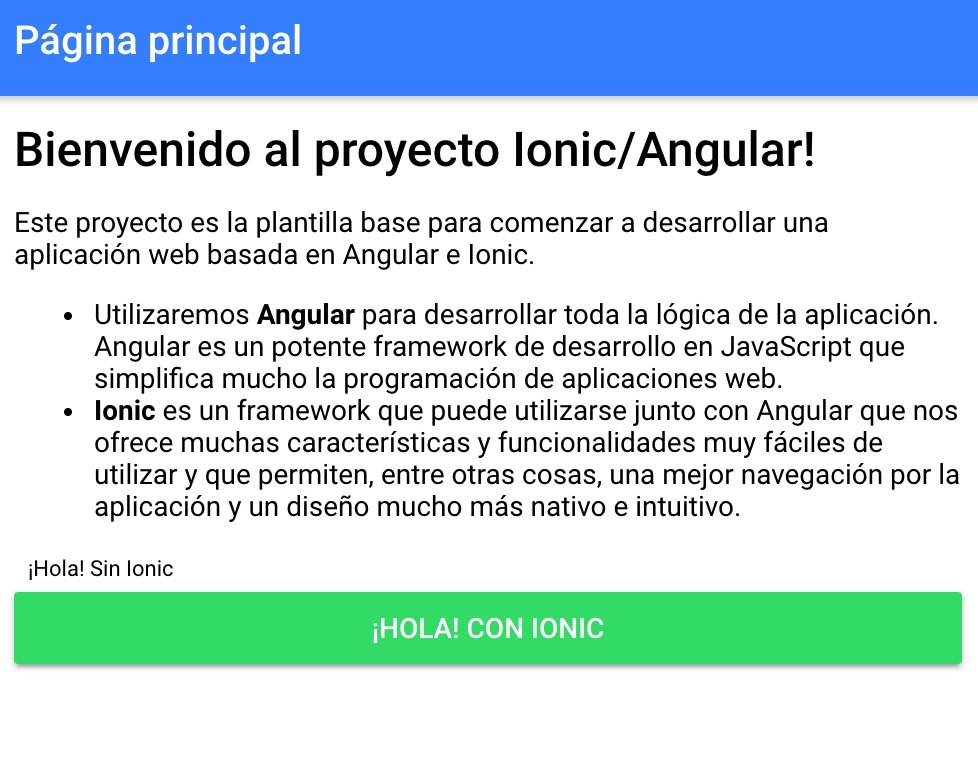

# Estructura de un proyecto Angular

## ¿Qué es Angular?

[Angular](https://angular.io/) es un framework de desarrollo de aplicaciones web que utiliza el lenguaje de pgoramación JavaScript. Por si no lo sabes, el término *framework* se traduce al castellano por *marco de trabajo*, y en programación se refiere a un conjunto de herramientas que se utilizan para el desarrollo e implementación de una aplicación, y a las que se les da un nombre global para poder identificar de qué estamos hablando. Las **ventajas que nos proporcionan los frameworks** son muchas:
* Disponen de una estructura global de la aplicación que simplemente debemos rellenar.
* Facilita la colaboración entre programadores.
* Facilita la utilización de herramientas (utilizades, librerías, etc) adaptadas al framework para facilitar el desarrollo.

Dejando un poco atrás el tema del término framework, nos vamos a centrar un poco más en Angular. **Angular**, como hemos comentado, **es un framework de desarrollo de aplicaciones web basado en JavaScript**, y nos proporciona las siguientes grandes ventajas:
* Permite crear **aplicaciones web SPA** de forma muy sencilla. Una aplicación SPA (*Single Page Application*) es una aplicación en la que la navegación entre las distintas páginas o pantallas no recarga el navegador, lo que la hace muy rápida y dinámica.
* Ofrece muchas **utilidades para el desarrollo web** para trabajar de forma muy sencilla y optimizada. Por ejemplo, permite añadir componentes extra en el código HTML que nos permiten hacer bucles, utilizar estructuras condicionales if-else...

## Estructura básica de un proyecto Angular

Ahora que tenemos un poco más claro qué es Angular, vamos a ver **cuál es la estructura básica de ficheros en un proyecto de estas características**. Veremos una sencilla estructura en carpetas y las principales funciones de los ficheros más importantes.

> **IMPORTANTE:** Debes saber que el proyecto sobre el que vamos a trabajar es una **plantilla básica de Angular optimizada para StackBlitz**. En un proyecto de Angular utilizado para trabajar en nuestro IDE instalado en el ordenador tendríamos más ficheros y su estructura sería algo más compleja.

### Fichero `package.json`

El fichero `package.json` es un fichero muy común en muchos proyectos de aplicaciones que utilizan JavaScript como lenguaje motor para el desarrollo. Ofrece información útil acerca del proyecto y, además, contiene la **lista de dependencias** del proyecto. Las dependencias son todas aquellas librerías externas instaladas en el proyecto y que son necesarias para que funcione correctamente la aplicación o para dotarla de funcionalidades extra.


Si te fijas en la captura, StackBlitz nos ofrece una sección llamada `DEPENDENCIES`, situada en la esquina inferior izquierda, que nos permite instalar las librerías que necesitemos para nuestro proyecto. En un proyecto local (desarrollado en nuestro IDE de escritorio), este tipo de dependencias se instalan utilizando [**npm**](https://www.npmjs.com/). No es necesario para el proyecto, pero si tienes curiosidad en conocer más acerca de npm puedes visitar [este post](https://programadamente.wordpress.com/2015/11/28/npm-que-es-y-para-que-sirve/).

Más adelante instalaremos algunas librerías y entenderás mejor cómo funciona.

### Fichero `index.html`

Como ya sabrás, el fichero `index.html` es el fichero principal de nuestra página web. Este fichero es el fichero raíz de la aplicación web, y en él podemos escribir código HTML, CSS, JavaScript...

En un proyecto Angular, su función es exactamente esa. En él indicamos las dependencias JavaScript y CSS necesarias y escribimos el código HTML mínimo necesario para cargar nuestra aplicación.


Fíjate en la captura de pantalla anterior: ¡ya estamos empezando a ver los primeros detalles de la magia de Angular! Este `index.html` es común a la mayoría de aplicaciones que desarrollemos con Angular. Es decir, normalmente no lo vamos a tener que modificar. Pero es importante entender qué está haciendo. Fíjate en las últimas líneas del fichero:
* Por un lado, carga el fichero **CSS** (`build/main.css`) generado automáticamente por Angular que contiene los estilos de nuestra aplicación.
* Después, carga el **componente web que es la raíz principal de nuestra aplicación**: `<ion-app></ion-app>`. Digamos que todo lo que nosotros programemos lo haremos dentro de este componente, y aprenderemos más adelante cómo se hace.
* Por último, carga el JavaScript necesario para que funcione correctamente: `cordova.js`, `build/polyfills.js`, `build/vendor.js`, `build/main.js`.

No es necesario entender todo esto al 100%, ya que es propio de Angular y, como digo, normalmente no tendremos que modificarlo.

### Fichero `app/main.ts`

No es necesario entrar demasiado en detalle en este fichero. Este fichero es necesario para poder comenzar a cargar la aplicación Angular. Simplemente fíjate en su nombre: `main.ts`. Si te has fijado, en el `index.html` anterior tenemos una dependencia JavaScript `build/main.js`. Al ser un fichero `.ts` (TypeScript), lo que ocurre es que Angular compila directamente este fichero en `build/main.js` para después poder utilizarlo en nuestra aplicación.

> **NOTA**: StackBlitz está optimizado para que no aparezcan y no nos tengamos que preocupar de todas las carpetas donde se compilan los ficheros JavaScript o CSS (e.g `build`). Nosotros simplemente tenemos que ocuparnos del código fuente.

### Fichero `app/app.module.ts`

Si te has fijado, el fichero `main.ts` lo que hace en realidad es cargar el módulo `AppModule`, definido en este fichero. 


Este fichero tiene **dos funcionalidades principales**:
* Definir el **componente raíz** de la aplicación. En este caso es `MyApp`, que se importa de `./app.component` y se define con la línea `IonicModule.forRoot(MyApp)`. También se debe definir en las configuraciones de `declarations` y `entryComponents`.
* Indicar los **componentes de entrada** de la aplicación. Las aplicaciones de Angular se componen por páginas (y se definen en la carpeta `pages`). En este caso, tenemos (además de `MyApp`, `HomePage`). Se deben definir en `declarations` y en `entryComponents`.

Por ahora, es todo lo que necesitas saber acerca de este fichero.

### Fichero `app/app.component.ts`

Los anteriores ficheros son algo complejos y no es necesario llegar a entender al 100% lo que hacen para poder desarrollar aplicaciones muy chulas con Angular.

En este fichero es donde comenzaremos a desarrollar nuestra aplicación. Aquí es donde indicamos **cuál será la página principal de la aplicación**, entre otras cosas.

Por ahora seguimos adelante, que luego volveremos a este fichero.

### Directorio `pages`

Si te has fijado en los ficheros `app/app.module.ts` y `app/app.component.ts`, hemos importado en ambos el elemento `HomePage` de la siguiente forma: 

```typescript
import { HomePage } from '../pages/home/home';
```

Lo que estamos haciendo es importar la página llamada `HomePage` para poder utilizarla como sea conveniente. **Todas las páginas de la aplicación las definiremos en el directorio `pages`**. Y, dentro del directorio `pages`, crearemos un directorio para cada página que creemos. 


Como vemos, el directorio `pages/home` tiene dos ficheros: `home.html` y `home.ts`. También podría contener un fichero `home.css` o `home.scss`, donde podríamos añadir los estilos CSS o SCSS necesarios para nuestra página.

Fíjate en el contenido del fichero `pages/home/home.ts`. 


Este fichero es, simplemente, una clase: la clase `HomePage`. Sin embargo, con la anotación `@Component` que ofrece Angular, le estamos indicando lo siguiente:
* **`selector`**. Estamos diciendo que su selector en el código HTML será `page-home`. Esto permite que si queremos después utilizar esta página en otro fichero HTML, tendremos que indicarlo simplemente así: `<page-home></page-home>`. Igual que hicimos en el `index.html` con `<ion-app></ion-app>`, ¿recuerdas?
* **`templateUrl`**. El fichero HTML en el que escribiremos el código HTML de esta página. Si te fijas, es `home.html`, que es el que tenemos creado en el directorio `pages/home`.

Ves ahora al fichero `pages/home/home.html`. ¿Qué ves? ¡Sí! Código HTML puro y duro. 


Es cierto que en las primeras líneas tenemos unos componentes HTML algo extraños: `<ion-header>, <ion-navbar>, <ion-title>, <ion-content>`. Bien, estos son **componentes propios de [Ionic](https://ionicframework.com/)**. Ionic lo veremos más adelante, pero te adelanto algo: es un framework (sí, otro) totalmente compatible con Angular que **nos permite añadir funcionalidades muy chulas a nuestra aplicación y hacer que el estilo mejore muchísimo**. Estos componentes son los que permiten añadir la cabecera que ves en la captura de a continuación, y... ¡sin añadir una sola línea de CSS!

¿Quieres ver **un pequeño adelanto de Ionic**? Bien, haz que tu `<ion-navbar>` quede así:

```html
<ion-navbar color="primary">
```

Y añade estas dos líneas justo después de `</ul>`:

```html
  <button>¡Hola! Sin Ionic</button>
  <button ion-button block color="secondary">¡Hola! Con Ionic</button>
```



¿Ves la diferencia? El primer botón no está utilizando Ionic, y es realmente feo (casi ni se ve). Para arreglarlo, tendríamos que apañárnoslas con CSS. El segundo botón está haciendo uso de Ionic, simplemente le estamos diciendo que es un botón Ionic (`ion-button`), que queremos que ocupe todo el ancho (`block`), y que queremos que el color sea el secundario de la aplicación (`color="secondary"`, por defecto verde).

---

Vamos a profundizar un poco más en Angular. Ve a la siguiente sección: [Introducción a Angular](./practica-angular-ionic-3.md)