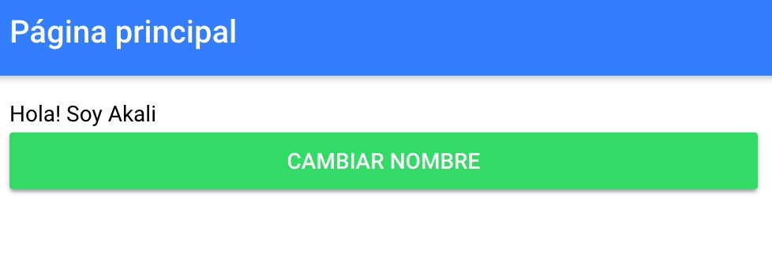
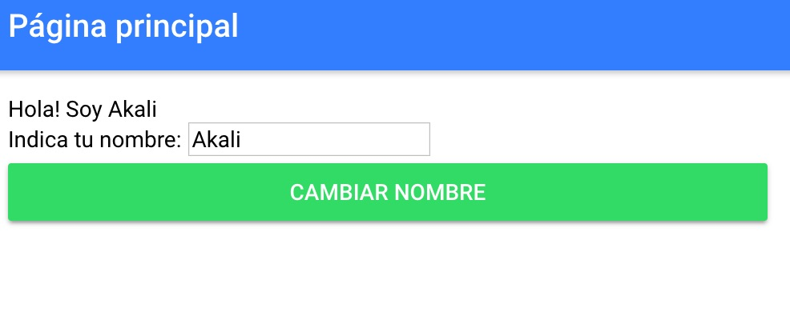
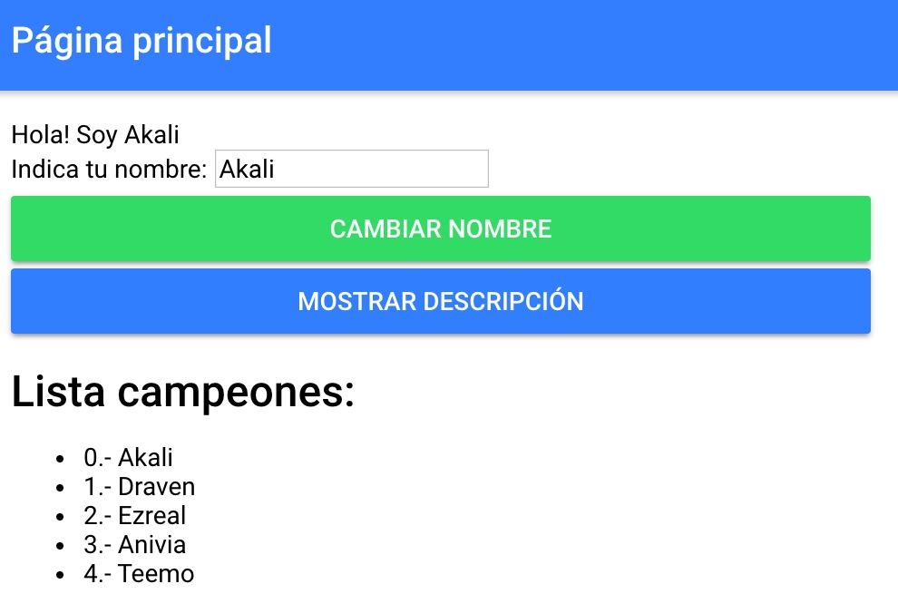
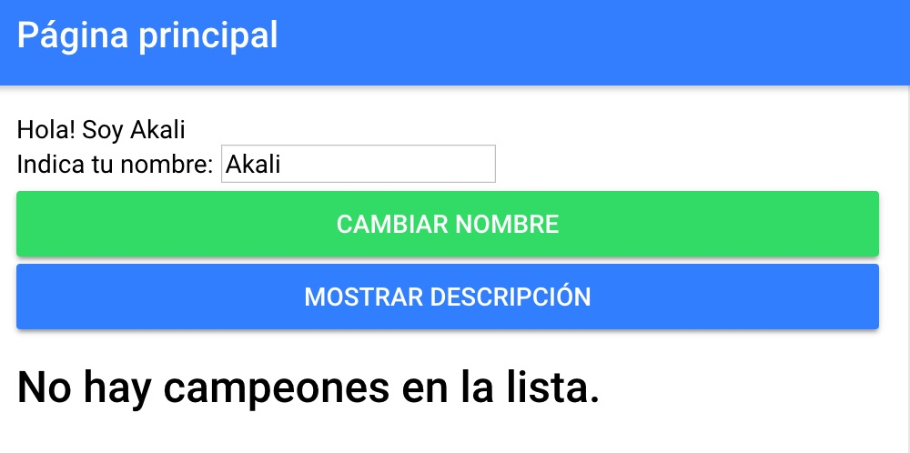
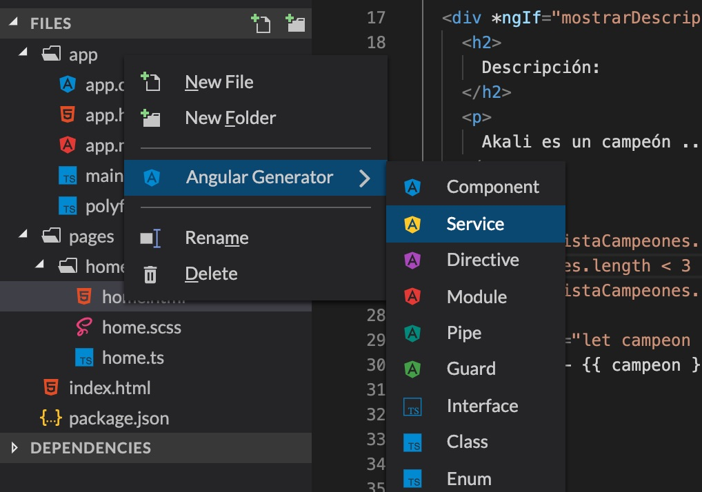
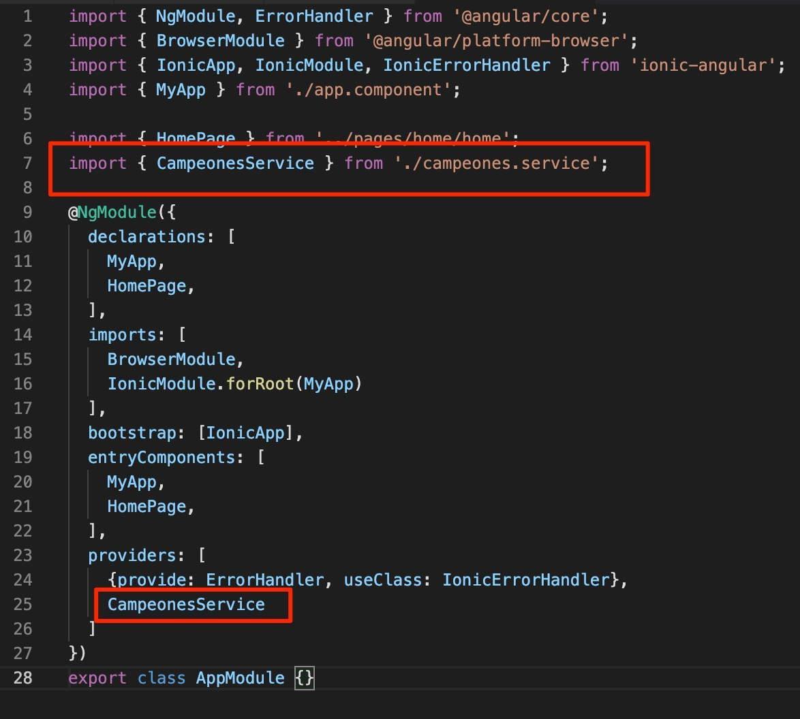
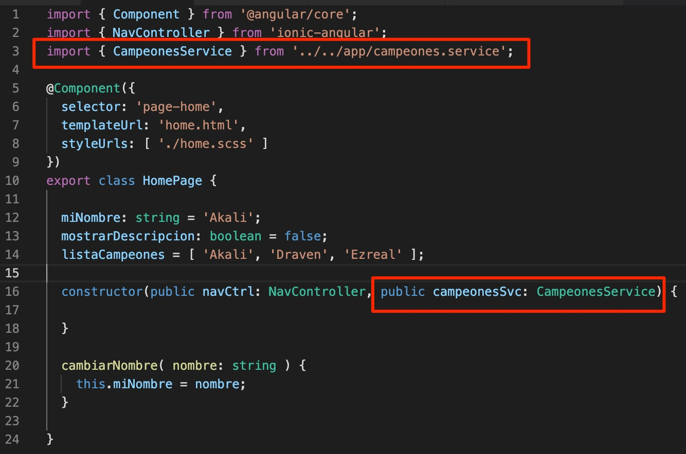
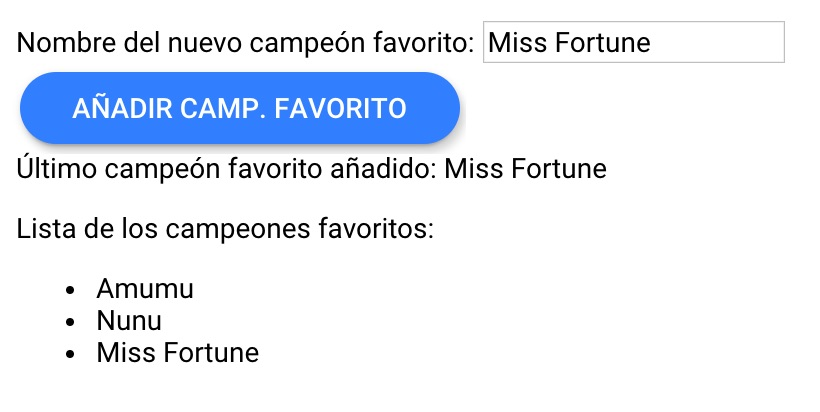



# Introducción a Angular

En la [sección anterior](./practica-angular-ionic-2.md) vimos la estructura básica y los principales ficheros de una aplicación en Angular. Incluso hicimos un pequeño adelanto de la potencia de Ionic.

En esta sección vamos a tratar de hacer un **repaso por las principales funcionalidades de Angular** que nos pueden ser muy útiles para desarrollar nuestra aplicación.

## *Binding*

El *binding*, traducido al castellano como *unión* o *atadura* es un mecanismo que nos permite unir o asociar variables entre el fichero `.html` y el fichero `.ts`.

Por ejemplo, la página home (`pages/home`) dispone de los ficheros `home.ts` y `home.html`. En Angular, a este fichero `.ts` se le llama **controlador**, porque es el fichero encargado de controlar lo que ocurre en el fichero `.html`. 

Pero, ¿cómo asociamos un controlador a su `.html`? Bueno, ya lo vimos en la sección anterior: necesitamos indicar que la clase `HomePage` es un componente Angular y, dentro de la anotación `@Component` le indicamos que su fichero `.html` es `home.html` en la variable `templateUrl`. De esta forma, el fichero `home.ts` se ha convertido automáticamente en el controlador de `home.html`.


Ahora podremos unir variables entre el `.html` y el `.ts`, lo que se conoce como `binding`.

### *One-way binding*

El *one-way binding* o **binding de una única dirección** es el que permite que:
* La vista (el `.html`) pueda mostrar variables definidas en el controlador (`.ts`) y que se actualice siempre que se actualicen estas variables.

o al revés:

* El controlador (`.ts`) pueda enterarse de eventos que ocurren en la vista (`.html`). Un ejemplo sería que cuando se haga click en un botón, se ejecute una función definida en el controlador.

Vamos a verlo con ejemplos. Añade el siguiente atributo en la clase `HomePage`:

```typescript
miNombre: string = 'Akali';
```

Y añade esta línea en `home.html` (dentro de `ion-content`):

```html
Hola! Soy {{ miNombre }}
```

Guarda ambos ficheros. ¿Qué está ocurriendo? ¡Se está sustituyendo `{{ miNombre }}` por la variable definida en el controlador! Angular está procesando lo que se encuentra entre llaves y lo está sustituyendo por el contenido de la variable del controlador. Es lo que se conoce como **interpolación**. Dentro de las llaves podemos escribir código TypeScript válido en el controlador.

El tipo de *one-way binding* que acabamos de ver es el que permite que **cuando se modifica una variable en el controlador, se actualice la vista** en consecuencia.

Vamos a ver ahora **el contrario**: **que la vista pueda actualizar variables y ejecutar código en el controlador**. Elimina ahora en el html la línea del botón que no utiliza Ionic y todo el texto de arriba, para que no moleste. Modifica el botón que utiliza Ionic, de modo que quede así:

```html
 <button ion-button block color="secondary" (click)="miNombre = 'Draven'">Cambiar nombre</button>
```



Si lo pruebas y haces click sobre el botón, verás que el texto `Hola! Soy Akali` se sustituye por `Hola! Soy Draven`. ¿Qué es lo que está ocurriendo en realidad? Estamos indicando que cuando ocurra el evento `click` sobre el botón (fíjate que se pone entre paréntesis `(` y `)` el nombre del evento), ejecutaremos lo siguiente: `miNombre = 'Draven'`, osea, código TypeScript sencillo que podríamos utilizar en el controlador. En este caso, estamos modificando la variable `miNombre` definida en el controlador por el string `'Draven'`. Modifica ahora el botón de la siguiente forma:

```html
 <button ion-button block color="secondary" (click)="cambiarNombre('Draven')">Cambiar nombre</button>
```

Y añade la siguiente función en el controlador:

```typescript
cambiarNombre( nombre: string ) {
    this.miNombre = nombre;
}
```

Pruébalo ahora. Debería hacer exactamente lo mismo. Ahora, lo que estamos haciendo es ejecutar directamente una función del controlador desde el html. **¿No te parece maravilloso?**. Y todo esto ¡gracias a Angular!

### *Two-way binding*

El *two-way binding* o **binding de doble dirección** es el que permite a algunos componentes especiales que la vista actualice la variable del controlador, y que además la vista se actualice cuando esta variable sea modificada en el controlador. Por ejemplo, **lo podemos utilizar con los elementos `input`**. 

Vamos a verlo. Añade lo siguiente en el html:

```html
<br>
  Indica tu nombre: <input type="text" [(ngModel)]="miNombre"/>
```

La propiedad `[(ngModel)]` permite hacer un binding de doble dirección del elemento `input` con la variable `miNombre`. Los corchetes (`[` y `]`) indican que el elemento `input` obtendrá su valor de la variable `miNombre` definida en el controlador. Y los paréntesis (`(` y `)`) justamente lo contrario: que la variable del `miNombre` del controlador se actualizará en base a lo que el usuario introduzca en el `input`.

Pruébalo tú mismo. Verás que cuando guardes, directamente aparecerá en el input `Akali`. Esto es porque está funcionando: ¡se está mostrando en el input el valor de la variable `miNombre`!



Pero no acaba ahí: escribe ahora otra cosa en el input. ¡Sí! **Se modifica en tiempo real** el texto `Hola! Soy Akali` por `Hola! Soy ...` (lo que sea que hayas escrito). Prueba ahora el botón. Se está cambiando tanto el texto como el contenido del input.

¿Qué te parece? Esto es sólo un poco de la potencia de Angular. Si quieres saber más acerca del *binding* existen múltiples recursos disponibles en internet, como por ejemplo la [documentación oficial](https://angular.io/guide/template-syntax).

## Condicionales y bucles

### Condicionales

Podemos añadir condicionales `if` propios de Angular dentro del html. Esto es muy útil para mostrar u ocultar una parte del html dependiendo de una condición booleana, que podría ser una variable del controlador.

Veamos un ejemplo. Añade la siguiente variale en el conrolador:

```typescript
mostrarDescripcion: boolean = false;
```

Añade lo siguiente en el html:

```html
<button ion-button block color="primary" (click)="mostrarDescripcion = true">
    Mostrar descripción
</button>

<div *ngIf="mostrarDescripcion">
    <h2>
        Descripción:
    </h2>
    <p>
        Akali es un campeón ...
    </p>
</div>
```

Estamos añadiendo la **directiva** `*ngIf` en el elemento `<div>` que contiene dentro un título y un párrafo con una descripción. En el `*ngIf` debemos poner una sentencia que implique devolver un valor booleano: `true` o `false`. En este caso, estamos utilizando el atributo booleano `mostrarDescripcion` del controlador para mostrar o no ese `<div>` y, por tanto, su contenido.

También hemos añadido un botón en el cual, al hacer click, estamos modificando el atributo `mostrarDescripcion` a `true`. 

Pruébalo: al principio no debería aparecer ni el título ni la descripción, pero al hacer click en el botón, debería mostrarse.

### Bucles

Angular también cuenta con una directiva para html que permite simular los típicos bucles de cualquier lenguaje de programación. La sintaxis de esta directiva es de esta forma: `*ngFor="let elemento of lista"`, y lo que hace es **replicar el elemento en el cual se pone tantas veces como elementos tenga la lista que estamos recorriendo**.

Veamos un ejemplo. Añade el siguiente atributo en el controlador:

```typescript
listaCampeones = [ 'Akali', 'Draven', 'Ezreal', 'Anivia', 'Teemo' ];
```

Ahora, añade el siguiente código en el html:

```html
<h2 *ngIf="listaCampeones.length > 0">Lista campeones:</h2>
<h2 *ngIf="listaCampeones.length == 0">No hay campeones en la lista.</h2>
<ul>
    <li *ngFor="let campeon of listaCampeones; let i = index">
        {{ i }}.- {{ campeon }}
    </li>
</ul>
```

> He aprovechado para añadir un posible uso de del `*ngIf`. Si el tamaño de la lista `listaCampeones` es mayor que 0, mostraremos el elemento `h2` con título `Lista campeones:`. En caso de que `listaCampeones` tenga un tamaño igual a 0, mostraremos el elemento `h2` con título: `No hay campeones en la lista`.

Fíjate en como se utiliza el `*ngFor`: estamos recorriendo todos los elementos de la lista `listaCampeones`, y cada elemento concreto lo tenemos en la variable `campeon`. También podemos extraer el **índice** del elemento de la lista poniendo un `;` después de la lista y añadiendo: `let i = index`. Podremos utilizar en este momento tanto la variable `campeon` como la variable `i` ( que serán el nombre del campeón y el índice de ese campeón en la lista, respectivamente) y utilizar la interpolación para mostrarlos en el html. ¿No te parece muy potente?



Prueba ahora a vaciar la lista del controlador: `listaCampeones = [];`. Debería mostrarse el título: `No hay campeones en la lista`.



## Directiva ngClass

La directiva `ngClass` es sencilla de utilizar y puede resultarnos muy útil en algunas ocasiones. Permite que un elemento adquiera o pierda una o diversas clases basados en valores booleanos que podemos tener en el controlador.

Antes de ver cómo funciona esta directiva, vamos a ver **cómo podemos añadir hojas de estilo CSS** a nuestro html. En `pages/home` crea el fichero `home.scss`. Ahora, modifica la anotación `@Component` del controlador de home para que utilice el fichero `.scss` que acabas de crear, tal que así:

```typescript
...
@Component({
  selector: 'page-home',
  templateUrl: 'home.html',
  styleUrls: [ './home.scss' ]
})
export class HomePage {
...
```

Se utiliza el atributo `styleUrls` de esta anotación como un array al cuál le podemos indicar los distintos ficheros CSS o SCSS que queremos que se asocien a nuestra vista HTML. Añade los siguientes estilos en `home.scss`:

```scss
$color-verde: green;
$color-naranja: orange;

page-home {
  .color-verde {
    color: $color-verde;
  }

  .color-naranja {
    color: $color-naranja;
  }
}
```

Y modifica el anterior `h2` para que quede así:

```html
  <h2 *ngIf="listaCampeones.length > 0" [ngClass]="{ 'color-verde': listaCampeones.length >= 3, 'color-naranja': listaCampeones.length < 3 }">Lista campeones:</h2>
```

Lo primero en lo que te debes fijar es que el `ngClass` está encuadrada en corchetes `[` y `]`. Esto significa que es una directiva de *one-way binding* y que es el controlador el que actualiza la vista cuando alguna de las variables que afectan a la directiva se ve modificada.

Además, fíjate en la sintaxis de utilización del `ngClass`. Se está indicando un JSON, en el cual las claves son las clases CSS a añadir al componente y los valores son las condiciones booleanas para añadir o no dichas clases. En el ejemplo, la clase `color-verde` se añadirá al `h2` siempre que la lista de campeones tenga igual o más de 3 elementos. Por contra, la clase `color-naranja` se añadirá al `h2` siempre que la lista de campeones tenga menos de 3 elementos. Prueba a añadir o quitar campeones al array y fíjate en como van cambiando los colores.

## Providers o Servicios

Los **providers**, también conocidos como **servicios**, son clases utilizadas en Angular que permiten mantener una única instancia (objeto) de dicha clase y compartirla entre todas las páginas y componentes de la aplicación. Son muy parecidos a las **clases estáticas de Java**, y **se utilizan tanto para guardar datos que queremos que compartan todas las páginas o componentes** como para **crear funciones que se utilizarán en distintos puntos distintos de la aplicación**.

Vamos a verlo con un ejemplo. Haz click derecho sobre la carpeta `app` del proyecto, `Angular Generator` > `Service`. Dale el nombre `Campeones`.



El servicio generado tendrá solamente el siguiente código:

```typescript
import { Injectable } from '@angular/core';

@Injectable()
export class CampeonesService {

  constructor() { }

}
```

Si te fijas, es una clase normal y corriente, pero con la anotación `@Injectable()`. Esto es lo que hace Angular pueda saber que esta clase actúa como un servicio.

Pero no sólo esto es lo que hace que podamos utilizar el servicio como es debido. Entra en el fichero de configuración `app/app.module.ts`. Asegúrate de que queda de la siguiente forma:

> **Nota**: StackBlitz añade por defecto el servicio generador en este fichero. A mí me ha pasado que StackBlitz me ha añadido el servicio, pero no lo ha hecho correctamente, y me estaba dando un error. Es por ello que debes asegurarte de que te queda igual que en la captura (al final, que quede bien añadido en el array `providers`).



Si te fijas, lo que estamos haciendo en realidad es indicar en la configuración del módulo principal de la aplicación que la clase `CampeonesService` se utilizará como `provider` (osea, un servicio) en las distintas páginas y componentes de la aplicación.

Vamos a verlo en acción. Utilizaremos el servicio que acabamos de crear para guardar una lista que podremos utilizar en las distintas páginas de la aplicación. Haz que tu clase `CampeonesService` quede parecida a esta. Se guarda una lista de campeones favoritos en el servicio y se ofrecen métodos para añadir un nuevo campeón favorito y para obtener el último campeón favorito añadido a la lista:

```typescript
import { Injectable } from '@angular/core';

@Injectable()
export class CampeonesService {

  private campeonesFavoritos: string[];

  constructor() {
    this.campeonesFavoritos = [];
  }

  obtenerCampeonesFavoritos() {
    return this.campeonesFavoritos;
  }

  anyadirCampeonFavorito( campeon: string ) {
    this.campeonesFavoritos.push(campeon);
  }

  obtenerUltimoCampeonFavorito() {
    return this.campeonesFavoritos.length > 0 ? this.campeonesFavoritos[this.campeonesFavoritos.length - 1] : '';
  }

}
```

Para utilizar el servicio en el controlador home, es tan sencillo como añadirlo como un parámetro del constructor de la clase `HomePage`, quedando así:



Ahora, podemos utilizar el servicio en la página `HomePage` sin necesidad de instanciar la clase `CampeonesService`, ya que al ser un servicio es Angular el que la instancia por nosotros (osea, podemos utilizar `campeonesSvc` sin necesidad de hacer un `new CampeonesService()`) e inyecta en cada página la instancia única del servicio que tiene guardada. Esto quiere decir que, si utilizáramos el servicio en distintas páginas, por ejemplo, podríamos acceder a la misma lista, y la tendríamos actualizada y accesible en las distintas páginas.

Añadamos algo de código al html para interactuar con el servicio y ver que funciona:

```html
<br>
Nombre del nuevo campeón favorito: <input type="text" [(ngModel)]="nuevoCampeonFavorito">
<button ion-button round (click)="campeonesSvc.anyadirCampeonFavorito(nuevoCampeonFavorito)">Añadir camp. favorito</button>
<br>
Último campeón favorito añadido: {{ campeonesSvc.obtenerUltimoCampeonFavorito() }}
<p>Lista de los campeones favoritos:</p>
<ul>
    <li *ngFor="let campeonFavorito of campeonesSvc.obtenerCampeonesFavoritos()">
        {{ campeonFavorito }}
    </li>
</ul>
```

**Lee el código y trata de entender lo que hace**. Estamos utilizando continuamente el servicio `campeonesSvc` que tenemos en el controlador. No te olvides de añadir el atributo `nuevoCampeonFavorito: string;` al controlador para poder recoger el valor del `input`. Si lo pruebas, y añades varios campeones favoritos, deberías tener un resultado parecido a este:



---

Ya has visto una primera introducción a Angular y conoces los elementos básicos que, pese a ser pocos y básicos, nos permitirán desarrollar la mayor parte de nuestras aplicaciones en Angular. 

Ahora, ve a la siguiente sección: [Introducción a Ionic](./practica-angular-ionic-4.md)

