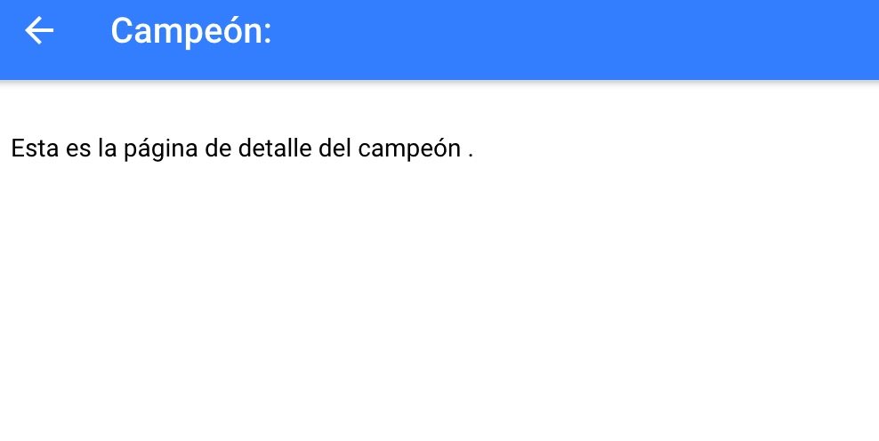
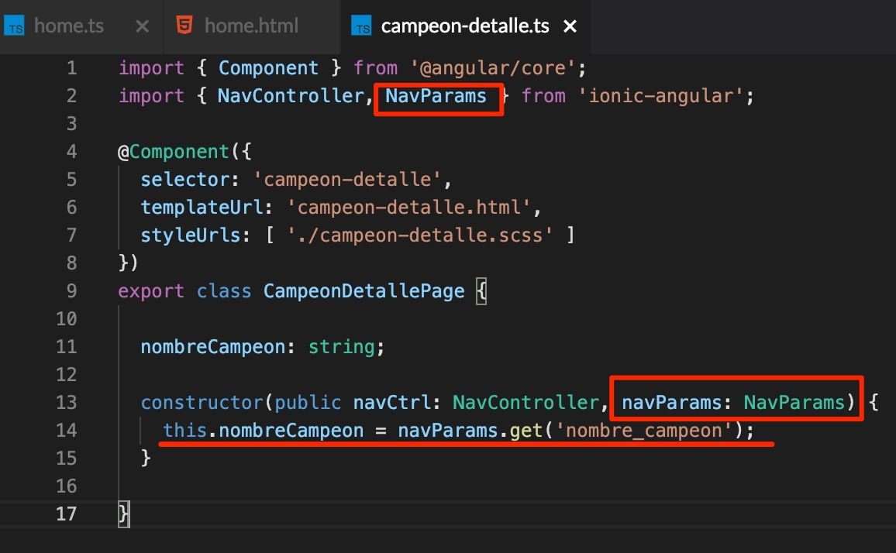
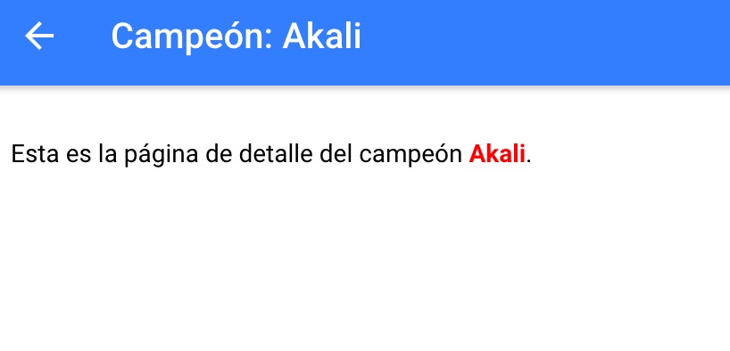
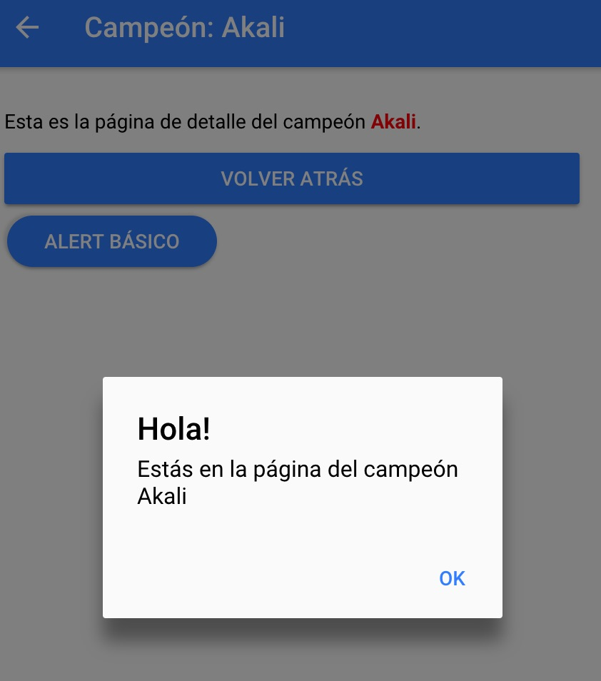



# Introducción a Ionic

[Ionic](https://ionicframework.com/) se define a sí mismo como un framework o kit de herramientas para desarrollar aplicaciones de alta calidad multiplataforma (iOS, Android y web) utilizando un único código base.

Nosotros vamos a **centrarnos únicamente en la potencia de Ionic para la web**, ya que nos permitirá **hacer las aplicaciones más bonitas visualmente** y además podremos utilizar algunas **funcionalidades muy útiles para la navegación entre páginas**, por ejemplo.

Hace poco salió la versión 4.x de Ionic, pero nosotros **vamos a trabajar con la versión 3.x** porque la 4.x todavía no está demasiado optimizada para utilizarla con StackBlitz, además de que es más compleja de utilizar.

[En este enlace](https://ionicframework.com/docs/v3/) está toda la documentación de la versión 3.x de Ionic. A continuación veremos algunas de sus principales funcionalidades para poder utilizarlas en nuestras aplicaciones. Una vez hayamos visto cómo utilizar algunas de ellas, el resto es simplemente cuestión de buscar en la web y utilizar la documentación oficial, que es muy buena.

## Navegación entre páginas

Ionic tiene una serie de componentes que hacen que podamos navegar entre las páginas de nuestra aplicación de forma muy sencilla. Digamos que Ionic utiliza un concepto que se llama la **pila de páginas** o **pila de navegación**, y que funciona exactamente como una pila (*stack*) de Java. 

A la pila de navegación le podemos ir añadiendo (***push***) y quitando (***pop***) páginas, de tal forma que **cuando quitamos una página volvemos a tener en lo más alto de la pila la última página** que añadimos. Este concepto se ve mucho más claro en la siguiente imagen.


### `push`

Vamos a verlo directamente con código. Crearemos una nueva página llamada `CampeonDetallePage`. Ve a la carpeta `pages` del proyecto y crea una nueva carpeta llamada `campeon-detalle`. Dentro, crea tres ficheros: `campeon-detalle.html`, `campeon-detalle.ts` y `campeon-detalle.scss`, con los siguientes contenidos:

`campeon-detalle.ts`

```typescript
import { Component } from '@angular/core';
import { NavController } from 'ionic-angular';

@Component({
  selector: 'campeon-detalle',
  templateUrl: 'campeon-detalle.html',
  styleUrls: [ './campeon-detalle.scss' ]
})
export class CampeonDetallePage {

  nombreCampeon: string;

  constructor(public navCtrl: NavController) {

  }

}
```

`campeon-detalle.html`

```html
<ion-header>
  <ion-navbar color="primary">
    <ion-title>Campeón: {{ nombreCampeon }}</ion-title>
  </ion-navbar>
</ion-header>

<ion-content padding>
  Esta es la página de detalle del campeón {{ nombreCampeon }}.
</ion-content>
```

`campeon-detalle.scss`

```scss
campeon-detalle {
  .nombre-campeon {
    color: red;
    font-weight: bold;
  }
}
```

Fíjate en el código y asegúrate de que entiendes lo que está haciendo.

Ahora tenemos que **definir nuestra nueva página** en el fichero de configuración `app/app.module.ts`. Asegúrate de que queda así:


Ahora, navegaremos desde nuestra página `home` hasta la página `campeon-detalle`. Para ello, utilizaremos la clase `NavController`, que seguramente habrás visto que aparece en los constructores de las clases de las páginas que hemos creado. Puedes encontrar toda la documentación acerca de este componente en [este enlace](https://ionicframework.com/docs/v3/api/navigation/NavController/). Pero vamos a ver cuáles son sus principales métodos y cómo los podemos utilizar para navegar entre páginas.

Añade la siguiente función al controlador `HomePage`:

```typescript
irAPaginaCampeonDetalle() {
    this.navCtrl.push( CampeonDetallePage );
}
```

> Asegúrate de importar la página `CampeonDetallePage`: `import { CampeonDetallePage } from '../campeon-detalle/campeon-detalle';`

Ahora, añade el siguiente botón en la vista de la página home:

```html
<button ion-button color="danger" clear (click)="irAPaginaCampeonDetalle()">Ir a página campeon-detalle</button>
```

**Pruébalo**. ¡Ya hemos navegado hasta la página `campeon-detalle`! 쮸 que es muy fácil? Además, si te fijas aparece por defecto el botón con la flechita para volver atrás. Esta es la magia de Ionic: como hemos hecho un `push`, quiere decir que hemos añadido una página a la pila de navegación. Por defecto, Ionic ya añade por nosotros las flechitas para ir atrás a la página anterior (y hará un `pop` sin que nosotros tengamos que decírselo).



Pero lo chulo sería que **pudiéramos decirle nosotros mismos a la página el nombre del campeón** que queremos que muestre, ya que ahora mismo lo muestra vacío. ¡Pues vamos a ello!

Añade la siguiente función al controlador `HomePage`:

```typescript
irAPaginaCampeonDetalleConParametroNombre( nombreCampeon: string ) {
    this.navCtrl.push( CampeonDetallePage, { 'nombre_campeon': nombreCampeon } );
}
  ```

El método `push` acepta como segundo parámetro un JSON al que podemos añadir toda la información que queramos. En este caso, estamos añadiendo el parámetro `nombre_campeon` y le estamos pasando el nombre del campeón recibido por parámetro en la función. 

Vamos a utilizar esta función en el html. Añade en `home.html` el siguiente botón:

```html
<button ion-button color="dark" clear (click)="irAPaginaCampeonDetalleConParametroNombre(campeon.nombre)"
>Ir a página campeon-detalle con parámetro nombre</button>
```

Lo único que estamos haciendo es llamar a la nueva función, y le pasamos por parámetro el campo `nombre` del atributo `campeon` del controlador, que recordemos es un objeto.

Pero todavía nos falta algo: recoger el parámetro `mi_nombre` que estamos enviando en el método `push` a la página `CampeonDetallePage`. Ve a `CampeonDetallePage` y asegúrate de que te queda así:



Estamos utilizando un nuevo componente: `NavParams`. Este componente también es propio de Ionic, y permite recoger los parámetros enviados desde otra página al hacer `push`. Lo que hacemos a continuación es tan sencillo como, en el constructor, asociar al atributo `nombreCampeon` el parámetro `nombre_campeon` enviado desde otra página con el método `push`. Esto lo podemos hacer utilizando el método `get(nombreParametro: string)` de `NavParams`.



Prueba a cambiar el nombre del campeón en la página `home`. Si vas a la página `campeon-detalle` con el botón `Ir a página campeon-detalle con parámetro nombre` deberías ver el nombre del campeón que hayas puesto en la página `home`.

### `pop`

Veremos de forma muy rápida y sencilla como utilizar el método `pop` para eliminar la página actual de la pila de navegación y volver a la página anterior (esto es lo que hace el botón de la flechita que aparece en la página `campeon-detalle` al ir hasta ella con `push`).

Añade el siguiente botón en la vista de `campeon-detalle`:

```html
<button ion-button block (click)="navCtrl.pop()">Volver atrás</button>
```

Si haces click sobre el botón `Volver atr맙`, verás que hace exactamente lo mismo que el botón de flechita de la cabecera. Sencillo, 쯨erdad?

### `setRoot`

Otro método interesante de `NavController` es el `setRoot`. Este método nos permite poner como página raíz de la pila de navegación la página que le pasamos por parámetro. Es decir, no añade la página encima del resto en la pila de navegación, si no que directamente hace que sea la raíz y por tanto no se puede volver a la página anterior (no podemos hacer `pop`).

Lo vamos a ver muy rápidamente. Añade el siguiente botón en la vista `home`:

```html
<button ion-button color="primary" outline (click)="hacerPaginaCameponDetalleRaiz()">Hacer que campeon-detalle sea la página raíz</button>
```

y la función en el controlador:

```typescript
hacerPaginaCameponDetalleRaiz() {
    this.navCtrl.setRoot( CampeonDetallePage );
}
```

Tan sencillo como eso. Si lo pruebas, verás que ya no aparece la flechita para volver atrás en la página `campeon-detalle`. Y encima, si haces click en el botón `Volver atrás`, no funcionará (de hecho, si abres la consola de StackBlitz verás que da un error indicando que la pila de navegación debe tener al menos una página raíz).


> Para poder volver a `home` tendrás que recargar el navegador.

## Alerts

Los alerts son elementos que permiten mostrar un mensaje al usuario por encima del resto de la página para darle algún tipo de información, informale acerca de un error, requerir que introduzca algún tipo de información...

Veremos algún ejemplo. Añade el componente `AlertController` a la página `CampeonDetallePage`. También añadiremos la función `mostrarAlertBasico()`:


Añade un botón que llame a esta función (hazlo tú esta vez, no te doy yo el código). Al hacer click sobre él, deberías ver lo siguiente:



Si te fijas, estamos creando un alert con el método `create` de `AlertController`. Le pasamos un JSON por parámetro, con las opciones `title`, `subTitle` y `buttons`. De esta forma, podemos personalizar el alert como queramos, modificando estos parámetros.

Ahora crearemos un alert en el que podamos introducir datos. Lo utilizaremos para poner un input que permita cambiar el nombre  del campeón. Añade la siguiente función al controlador `campeon-page`:

```typescript
mostrarAlertConInput() {
    const prompt = this.alertCtrl.create({
        title: 'Cambiar nombre',
        message: "Introduce un nuevo nombre para el campeón:",
        inputs: [
            {
                name: 'nombre',
                placeholder: 'Nombre'
            },
        ],
        buttons: [
            {
                text: 'Cancelar',
                handler: (data) => {
                    console.log('Click en cancelar');
                }
            },
            {
                text: 'Cambiar',
                handler: (data) => {
                    this.nombreCampeon = data.nombre;
                }
            }
        ]
    });
    prompt.present();
}
```

y añade un botón en el html que llame a esta función.


Es sólo cuestión de modificar los parámetros que le pasamos al alert, haciendo un poco de caso a la [documentación oficial](https://ionicframework.com/docs/v3/components/#alerts) sobre los alerts en Ionic.

쯈ué significan todos los parámetros?

El parámetro `inputs` recibe un array con los inputs que mostraremos en el alert. Es importante el atributo `name`, ya que después lo utilizaremos para recoger el valor del input, en el `handler` del botón `Cambiar`. 

Fíjate en los botones. Estamos definiendo ambos como un JSON, con parámetro `text` y `handler`. El parámetro `text` simplemente indica el texto que aparecerá en el botón, y el parámetro `handler` recibe una función, que a su vez recibe un parámetro (`data`). Esta función se ejecutará cuando hagamos click en el botón `Cambiar`. 

Lo que hacemos a continuación (`this.nombreCampeon = data.nombre;`) es modificar el atributo `nombreCampeon` de la clase `CampeonDetallePage`, y le asignamos `data.nombre`. En `data` estamos recibiendo todos los datos que hayamos introducido en los `input` del alert, y `nombre` es porque así se lo indicamos en el `name` del `input` que definimos en el parámetro `inputs`. Es decir, estamos recogiendo la información del input con `name` = `nombre` en la función que se ejecuta al hacer click sobre `Cambiar`. Lo verás mejor con las flechitas de la imagen:


Tienes toda la documentación acerca de como usar los alerts [aquí](https://ionicframework.com/docs/v3/components/#alerts).

- - - 

Ya has finalizado la práctica, puedes proceder a la [entrega](./index.md#entrega) 🚀de la misma 💃🏻.

