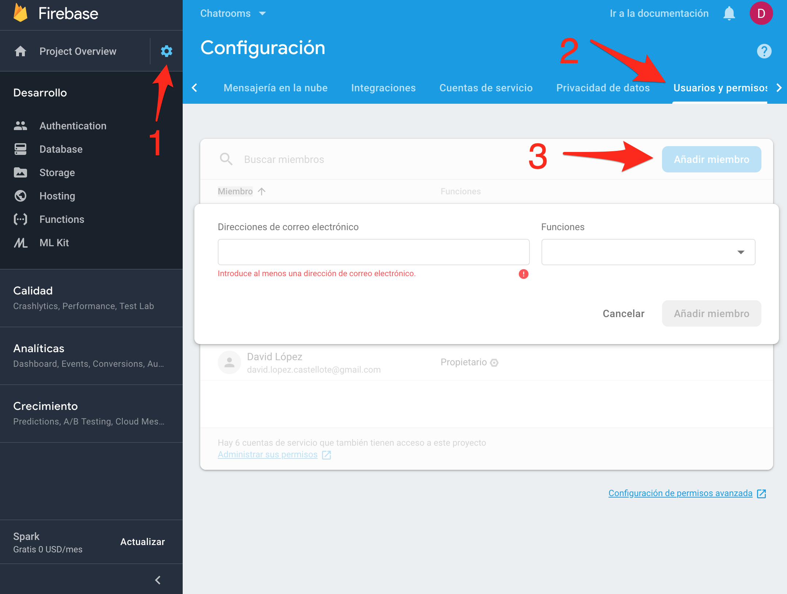

# Práctica 3: Integración de la aplicación web League of Legends con base de datos de Firebase

En esta práctica implementarás la integración de la aplicación web de campeones de LoL desarrollada en la práctica anterior. De esta forma, podrás listar, añadir y eliminar campeones de tu aplicación y guardar estas modificaciones en una base de datos real.

## Entrega

> **IMPORTANTE**: **Clona** el proyecto de tu aplicación de LoL de StackBlitz y empieza esta práctica sobre el proyecto clonado. No hagas las modificaciones en la aplicación sobre el proyecto de la práctica anterior, hazlo sobre una copia utilizando la opción *Fork* de StackBlitz.

Tendrás que entregar:
* Enlace al **proyecto de StackBlitz para poder ver el código de la aplicación**.
* **Código fuente** en un .zip de la aplicación de StackBlitz.
* Enlace a la **aplicación web desplegada en Firebase**.
* **Dar permisos** al correo electrónico al259345@uji.es con funciones de Editor al proyecto Firebase creado para la aplicación.
* **Un documento** con las siguientes reflexiones:
    - ¿Qué has aprendido en esta práctica?
    - ¿Qué te ha parecido más interesante?
    - ¿Qué no te ha quedado claro o crees no esta bien explicado?

---

👉🏻 [¡Comencemos!](./practica-app-lol-firebase-1.md)