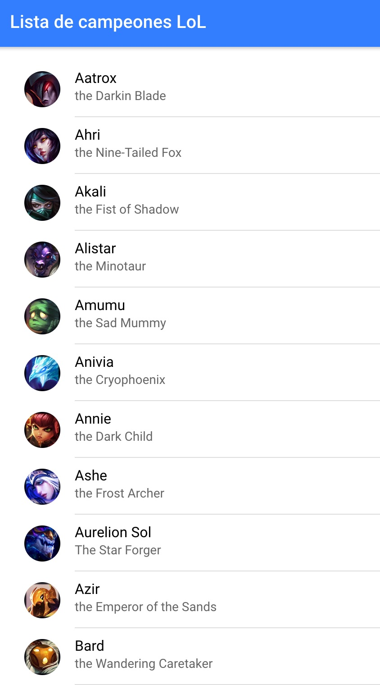

# Página para listar los campeones

Con este primer vídeo desarrollaremos la primera página de nuestra aplicación.

<iframe width="560" height="315" src="https://www.youtube.com/embed/06zN9dk1BJs" frameborder="0" allow="accelerometer; autoplay; encrypted-media; gyroscope; picture-in-picture" allowfullscreen></iframe>

## Recursos

* Plantilla starter para clonar: [https://stackblitz.com/edit/ionic3-plantilla-starter-bbdd1819](https://stackblitz.com/edit/ionic3-plantilla-starter-bbdd1819)
* Enlace al JSON con la lista de campeones (arreglado el problema de `http` por `https` que se comenta en el vídeo): [https://github.com/Dellos7/lol-champions/blob/master/champions.json](https://github.com/Dellos7/lol-champions/blob/master/champions.json)
* Enlace a la documentación de la versión 3 de Ionic: [https://ionicframework.com/docs/v3/](https://ionicframework.com/docs/v3/)
* URL imagen Ezreal: [https://ddragon.leagueoflegends.com/cdn/8.11.1/img/champion/Ezreal.png](https://ddragon.leagueoflegends.com/cdn/8.11.1/img/champion/Ezreal.png)

## Resultado

---

👉🏻 [Siguiente vídeo](./practica-app-lol-2.md)