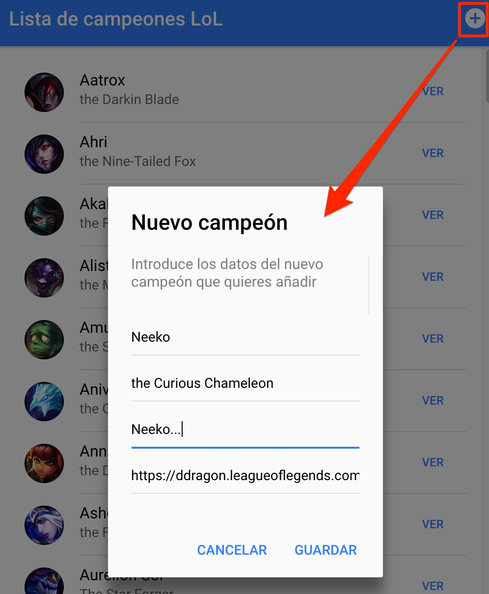

# Añadir y eliminar campeones

En este tercer vídeo veremos como añadir nuevos campeones a la lista y eliminar campeones de la misma:

<iframe width="560" height="315" src="https://www.youtube.com/embed/eypIw8iuMeA" frameborder="0" allow="accelerometer; autoplay; encrypted-media; gyroscope; picture-in-picture" allowfullscreen></iframe>

## Resultado

- - - 

Ya has finalizado la práctica, puedes proceder a la [entrega](./index.md#entrega) 🚀de la misma 💃🏻.