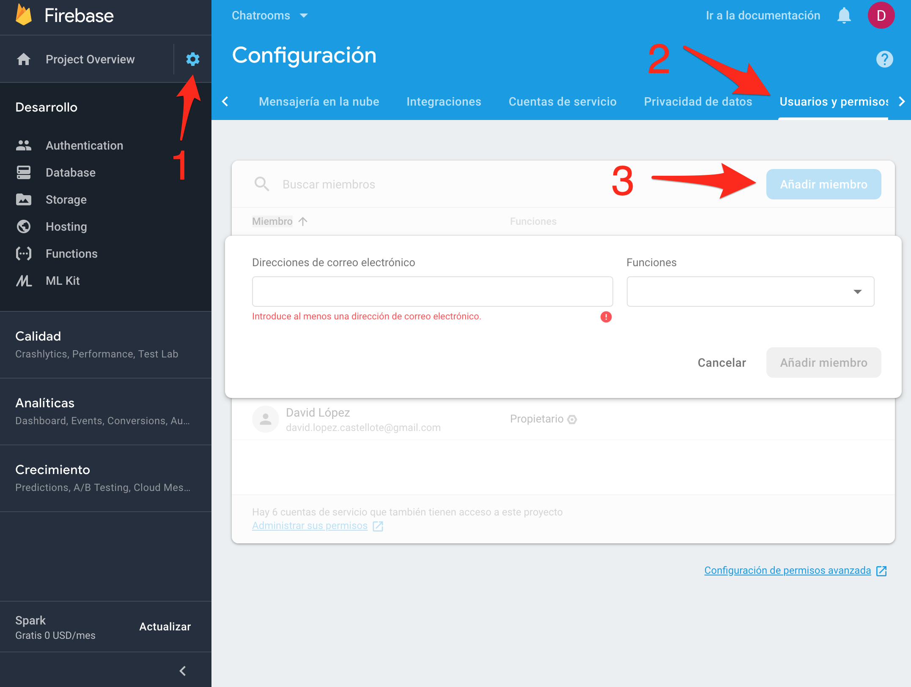
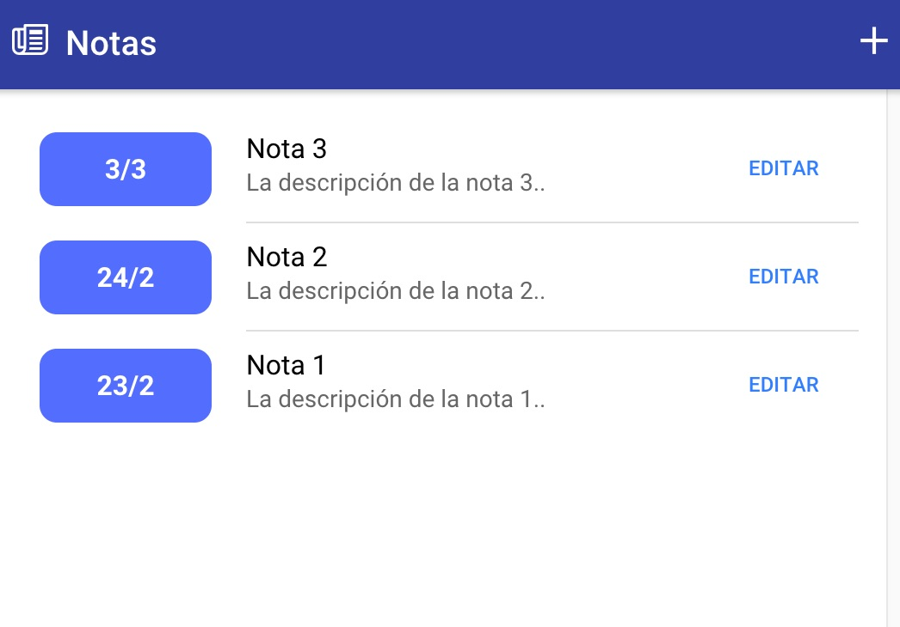
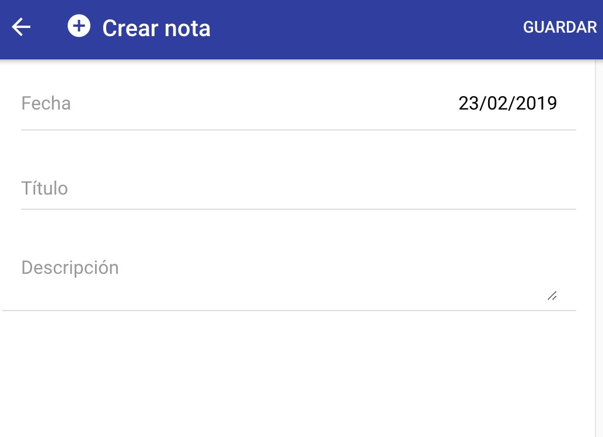
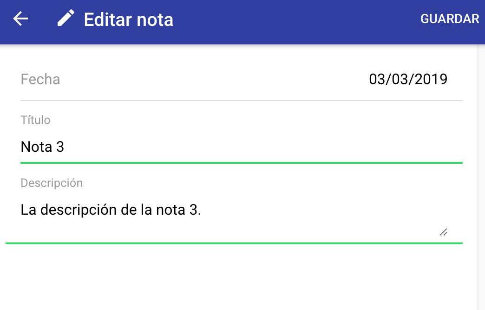

# Práctica 4: Trabajo autónomo. Aplicación de notas

En esta práctica implementarás de forma autónoma una aplicación sencilla de notas que tendrá los siguientes requisitos:

* Una pantalla en la cual se listen las notas almacenadas en la base de datos de Firebase. Deberán ordenarse por fecha.
* Las notas deberán tener, al menos, los siguientes campos: `titulo`, `descripcion`, `fecha`.
* Desde la aplicación se podrán hacer, además, las siguientes acciones:
    * Crear una nueva nota con los campos mencionados.
    * Editar una nota existente.
    * Eliminar una nota.

Más adelante tienes un ejemplo de las pantallas de la aplicación y una [sección de ayuda](#ayuda) que quizá necesites consultar para algunos aspectos más complejos de la app. Además, **debes tener en cuenta lo siguiente**:
* **Céntrate en la funcionalidad.** Si quieres cambiar o mejorar el estilo o el diseño, déjalo para el final.
* Tu aplicación **no debe ser exactamente igual que la de ejemplo**. Puedes decidir tú mismo cómo hacerla, pero debe cumplir los requisitos indicados.
* Apóyate en el código que has desarrollado para las prácticas anteriores, ya que te ayudará a realizar la mayor parte de la aplicación. Piensa en cómo lo hiciste antes y de qué forma similar lo podrías hacer ahora.
* Más adelante dispones de una **sección de ayuda** que puedes consultar para aquellos problemas que, según los requisitos, es más posible que te encuentres (por ejemplo, gestión de fechas).
* La gestión de fechas no es lo más importante (además de que es probablemente lo más complejo). Te recomiendo que te centres en el resto de funcionalidades y dejes esto para el final.

## Entrega

Tendrás que entregar:
* Enlace a la **aplicación web desplegada en Firebase**. Mira [este vídeo](https://youtu.be/I7lio33gv_o) sobre cómo desplegar una aplicación de StackBlitz en Firebase.
* **Dar permisos** al correo electrónico al259345@uji.es con funciones de Editor al proyecto Firebase creado para la aplicación.
* Enlace al **proyecto de StackBlitz para poder ver el código de la aplicación**.
* **Código fuente** en un .zip de la aplicación de StackBlitz.
* **Un documento** con las siguientes reflexiones:
    - ¿Qué has aprendido en esta práctica?
    - ¿Qué te ha parecido más interesante?
    - ¿Qué no te ha quedado claro o crees no esta bien explicado?



## Aplicación de ejemplo

[https://app-diario-notas.firebaseapp.com/?93459](https://app-diario-notas.firebaseapp.com/?93459)

## Pantalla lista notas



## Pantalla crear nota



## Pantalla editar nota



# Ayuda

Es posible que durante el desarrollo de la aplicación te encuentres con problemas que no sepas en un primer momento cómo resolver. 

En esta sección se presentan soluciones para los que pudieran resultarte más problemáticos, y de esta forma puedas centrarte en el desarrollo sin tener que perder demasiado tiempo en resolverlos.

## Fechas

La gestión de fechas es algo problemática, ya que una fecha almacenada en la base de datos de Firebase no es igual que una fecha de JavaScript. Es por ello que puedes utilizar el siguiente servicio (deberás crearlo en tu aplicación tú mismo), que dispone de algunas funciones para convertir fechas entre Firebase y JavaScript.

```typescript
import { Injectable } from '@angular/core';
import * as firebase from 'firebase';

/**
 * Algunas referencias de ayuda:
 * - Fechas en JavaScript: https://www.w3schools.com/jsref/jsref_obj_date.asp
 * - Formato fecha ISO en JavaScript: https://www.w3schools.com/jsref/jsref_toisostring.asp
 * - Fecha en Firebase: https://firebase.google.com/docs/reference/android/com/google/firebase/Timestamp
 */

@Injectable()
export class FechaFirebaseService {

  constructor() { }

  /**
   * Convierte una fecha recibida de Firebase en una fecha en formato ISO de JavaScript.
   * Es útil utilizarlo cuando queremos utilizar la fecha de Firebase en la aplicación (por ejemplo, para mostrarla en la vista).
   */
  convertirFechaFirebaseAFechaJavaScriptISO( fechaFirebaseISO: firebase.firestore.Timestamp ) {
    if( fechaFirebaseISO instanceof firebase.firestore.Timestamp ) {
      return fechaFirebaseISO.toDate().toISOString();
    }
    return fechaFirebaseISO;
  }

  /**
   * Convierte una fecha de JavaScript en formato ISO en una fecha de Firebase, que se puede utilizar al guardar un documento en Firebase
   */
  convertirFechaJsISOAFechaFirebase( fechaIonicFormatoIso: Date ) {
    return new firebase.firestore.Timestamp(Math.round(new Date(fechaIonicFormatoIso).getTime() / 1000), 0);
  }

  /**
   * Este método convierte una fecha de Firebase en el formato "DD/M". Puede ser útil para mostrar el día y el mes en la aplicación, igual que en la captura de pantalla de ejemplo.
   */
  formatearFechaFirebase_DDM( fechaFirebase: firebase.firestore.Timestamp ) {
    let fechaJs = this.convertirFechaFirebaseAFechaJavaScriptISO(fechaFirebase);
    return new Date(fechaJs).getDate() + "/" +(new Date(fechaJs).getMonth() + 1);
  }

}
```

¿Cómo podrías utilizar estos métodos del servicio?

```typescript
//Imagina que el objeto "nota" es un documento recibido de Firebase y que tiene el campo "fecha"

let fechaNotaISO = this.fechaSvc.convertirFechaFirebaseAFechaJavaScriptISO( nota.fecha );

//En este momento, podrás utilizar "fechaNotaISO" para mostrar la fecha en la aplicación, utilizando por ejemplo el componente de Ionic que ya existe para ello
```

```typescript
//Imagina que el método "notasSvc.guardarNota(nota)" guarda el objeto "nota" en Firebase. El objeto nota tendría el campo "fecha" en formato ISO (tendría un binding con el componente de fecha de Ionic)

nota.fecha = this.fechaSvc.convertirFechaJsISOAFechaFirebase( nota.fecha );
this.notasSvc.guardarNota(nota);
```

```typescript
//Imagina que el objeto "nota" es un documento recibido de Firebase y que tiene el campo "fecha"

let fechaDiaMes_MostrarEnVista = this.fechaSvc.formatearFechaFirebase_DDM( nota.fecha );
```

## Guardar IDs generados automáticamente en Firebase

En los anteriores ejemplos hemos asignado de forma manual los IDs de los documentos que creábamos en Firebase (por ejemplo, el documento para el campeón `Ahri` tenía como identificador del documento `ahri`).

Sin embargo, quizá en una aplicación de notas no tenga sentido crear un ID manual para cada documento de nota.

Para crear un documento con un ID automático, recuerda que utilizábamos el método `add`. Ejemplo:

```typescript
crearDocumentoFirebaseConIdAutomatico( documento ) {
    this.coleccionFirebase.add( documento );
}
```

El **problema** que tenemos con esto es que cuando recibimos los datos de la colección, estos identificadores automáticos no nos aparecen por ningún sitio. Es decir, que si no existe el campo `id` creado de forma manual en el cuerpo del documento, no sabremos que ID tiene cada documento. Este ID lo necesitarás para poder editar o eliminar las notas, entre otras cosas.

Para crear el campo `id` en un documento de Firebase utilizando el método `add`, que crea un documento con un identificador automático, lo deberíamos hacer de la siguiente forma:

```typescript
crearDocumentoConIdAutomaticoYCampoId( documento ) {
    this.db.collection('nombre_coleccion').add(documento).then( (docGuardadoFirebase) => {
        let docId = docGuardadoFirebase.id;
        this.db.collection('nombre_coleccion').doc(`${docId}`).update({
            'id': docId
        });
    });
}
```

Lo que hacemos aquí es utilizar la función `then` del resultado de ejecutar el método `add`. A este método le podemos pasar una función (será un `callback`) y esa función recibirá el documento guardado en Firebase (en el ejemplo, `docGuardadoFirebase`). Este objeto recibido tiene el campo `id`, que podemos utilizar en ese momento junto con el método `update`, que sirve para actualizar el documento. Actualizamos por tanto el documento y le añadimos el campo `id` en el cuerpo del documento para poder utilizarlo después cuando lo necesitemos.

¿Cómo podemos **utilizar esta función que hemos creado**? Supongamos que tenemos en la variable `tituloNota` el título de la nota, en la variable `descripcionNota` la descripcion de la nota y en la variable `fechaNota` la fecha de la nota. Utilizaríamos la función que hemos creado así:

```typescript
//Creamos el JSON (documento) de la nota tal y como se almacenará en Firebase. Recordemos que en Firebase se llama documento, pero es análogo a un JSON en JavaScript
let nota = {
  titulo: tituloNota,
  descripcion: descripcionNota,
  fecha: fechaNota
};

//Suponiendo que nuestro servicio de notas se llama "notasSvc", llamamos a esa función pasándole simplemente la nota
this.notasSvc.crearDocumentoFirebaseConIdAutomatico( nota );
```

Simplemente el hecho de llamar a esa función, creará la nota en nuestra colección de Firebase con el ID de la nota en forma de campo en el cuerpo del documento. Osea, tendremos una nota en Firebase tal que así:

```json
{
  titulo: 'El titulo de la nota',
  descripcion: 'La descripción de la nota',
  fecha: '2019-04-26 10:20:00',
  id: 'hjwdbhyungf8392djiehuyfg' 
}
```

donde el campo `id` será el ID creado automáticamente por Firebase.